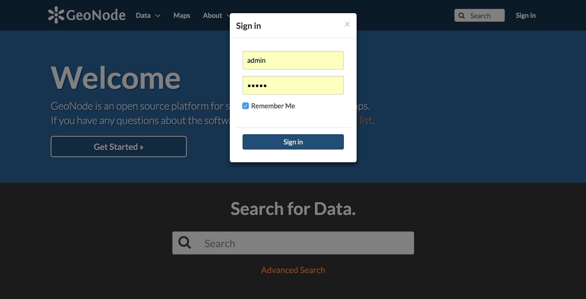
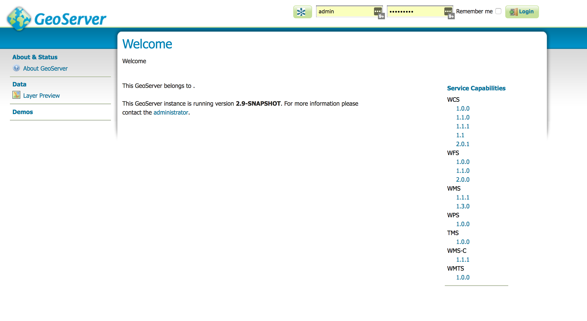
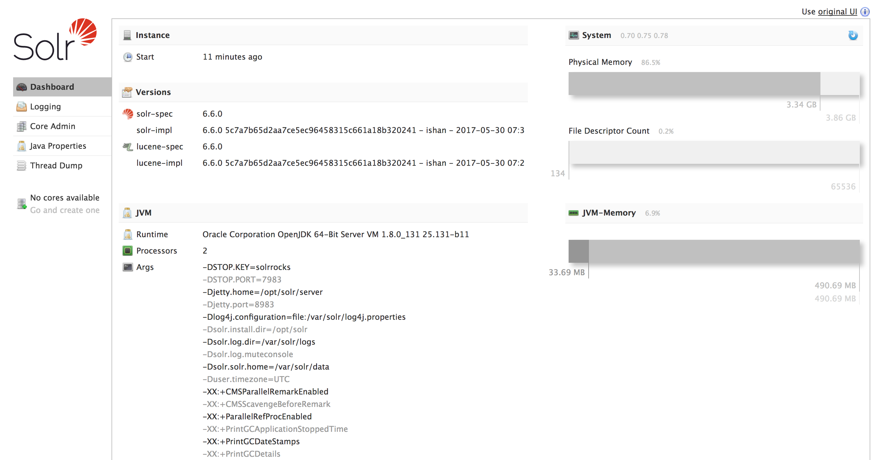

# Setup the workshop environment

In this first step of the workshop you will create the workshop development environment, running an instance of GeoNode and one instance of Solr. For this purpose you will create a virtual machine with Ubuntu 16.04 LTS using Vagrant, and you will install all of the needed components to have a working environment for the aims of the workshop.

At the end of this step you will have an Ubuntu box with operational instances of GeoNode and Solr.

## Git clone the workshop repository

Open your shell and clone the workshop repository:

```sh
$ git clone https://github.com/capooti/foss4g_2017_geonode_solr.git
```

## Start the Vagrant box and SSH into it

Vagrant is a command line utility for managing virtual machines. You will use it to manage the virtual machine needed in this workshop.

For what is needed for this workshop, you just need to start the Vagrant box and login into it using SSH:

```sh
$ cd foss4g_2017_geonode_solr
$ vagrant up
$ vagrant ssh
```

If you want more information about Vagrant, a good introduction is [here](https://www.vagrantup.com/intro/getting-started/index.html)

SSH, which stands for Secure Shell, creates a channel for running a shell on a remote computer, with end-to-end encryption between the local and the remote computer.

If you are new to SSH, a good introduction can be found [here](https://docstore.mik.ua/orelly/networking_2ndEd/ssh/ch01_01.htm)

## GeoNode installation

In this step of the workshop you will install GeoNode, on top of which you will build a testing geoportal in the next steps of the workshop.

[GeoNode](http://geonode.org/) is an Open Source, Content Management System (CMS) for geospatial data. It is a web-based application and platform for developing Geographic Information Systems (GIS) and for deploying Spatial Data Infrastructures (SDI).
For more information about it check [its documentation](http://docs.geonode.org/en/master/), the next steps of this workshop or both.

GeoNode it is based on Django, which is a great Python web framework. Other core components of GeoNode are PostgreSQL/PostGIS, GeoServer, pycsw or GeoNetworks and GeoExplorer.

### Install requirements

You will use the apt package manager to install the requirements for the environment.

You will install Python 2.7 (needed by GeoNode, which does not run on Python 3, the default Python version at Ubuntu 16.04) and all of the other requirements, including Java:

```sh
$ sudo apt-get update
$ sudo apt install python virtualenv python-dev build-essential gdal-bin libgdal-dev default-jre
```

GeoServer and Solr both run on top of a Java Runtime Environment. default-jre is the official Ubuntu JRE: make sure java is working by running the java -version command:

```
$ java -version
openjdk version "1.8.0_131"
OpenJDK Runtime Environment (build 1.8.0_131-8u131-b11-0ubuntu1.16.04.2-b11)
OpenJDK 64-Bit Server VM (build 25.131-b11, mixed mode)
```

### Create a virtual environment

GeoNode is based on Django, which is a Python web framework. It is generally a good idea to install all of the Python GeoNode requirements separately from the global system requirements. A great way to do this is using a tool like virtualenv.

If you are new to virtualenv you may take some minutes to read the [documentation](https://virtualenv.pypa.io/en/stable/)

For the aims of the workshop, create a Python virtual environment and activate it:

```sh
$ cd /workshop/
$ virtualenv --python=python2 env
$ . env/bin/activate
```

### Install GeoNode

You will install GeoNode 2.6.1 from GitHub. Here is what you need to do:

```sh
$ git clone https://github.com/GeoNode/geonode.git
$ cd geonode
$ git checkout -b 2.6.1 tags/2.6.1
$ pip install -e .
$ pip install pygdal==1.11.3.3
$ pip install ipython
$ paver setup
$ paver sync
```

ipython is not required by GeoNode, but it will be a very helpful tool for the purpose of this workshop.

### Test if GeoNode is running

If everything went smoothly, you should now be able to start GeoServer and GeoNode:

```sh
$ paver start_geoserver
$ python manage.py runserver 0.0.0.0:8000
```

Now try to access to the GeoNode instance at: http://localhost:8000/

Log in in GeoNode using the administrative account which should have been already created:

* user: admin
* password: admin



Now click on the "admin" (or whatever is the username you created for the superuser) link, and then on GeoServer.

The GeoServer administrative interface should corretly display at the url: http://localhost:8080/geoserver/web/



## Solr installation

[Apache Solr](http://lucene.apache.org/solr/) is an open source enterprise search platform, developed in Java, on top of the Apache Lucene project. Its major features include full-text search, hit highlighting, faceted search, real-time indexing, dynamic clustering, database integration, NoSQL features and rich document (e.g., Word, PDF) handling. Providing distributed search and index replication, Solr is designed for scalability and fault tolerance.

Solr provides a [great spatial support](https://cwiki.apache.org/confluence/display/solr/Spatial+Search) as well, which can be used for example for providing spacial facets to your SDI.
Solr is, with [Elasticsearch](https://www.elastic.co/products/elasticsearch), the most popular enterprise search engine nowadays.

NOTE: the workshop uses Solr as the search engine, but it should be relatively easy to switch the search engine to Elasticsearch.

As a first thing, download and extract the latest Solr release in your Vagrant box. Then install the service following these instructions:

```sh
$ cd /opt/
$ sudo wget http://apache.claz.org/lucene/solr/6.6.0/solr-6.6.0.tgz
$ sudo tar zxf solr-6.6.0.tgz
$ sudo tar xzf solr-6.6.0.tgz solr-6.6.0/bin/install_solr_service.sh --strip-components=2
$ sudo ./install_solr_service.sh solr-6.6.0.tgz
```

Now the Solr service should be already up and running.

Make sure that the Solr administrative interface is correctly running at http://localhost:8983/solr/#/



## PostgreSQL and PostGIS installation

By default, doing the GeoNode setup from git as you did, the Django database is created on sqlite, and the vector datasets (shapefiles) are uploaded as shapefile stores in GeoServer.

In production it is desirable to use a relational database in place of sqlite for the Django database. At the same time vector files are better stored in a spatial database: concurrent access will be optimized and transactions will be enabled - which means that GeoNode users will be able - if needed - to edit remotely the vector datasets using the GeoExplorer edit toolbar.

PostgreSQL, thanks to its wonderful spatial support provided by PostGIS, is by far the best choice for a RDBMS in GeoNode.

Install PostgreSQL and PostGIS from apt packages:

```sh
sudo apt-get install postgresql postgresql-contrib postgis
```
