# A GeoNode quickstart

In this first tutorial of the workshop you will use GeoNode as an end user. You will upload some layers using the user interface, then you will compile metadata for these layers and create a map with them.

You will use the datasets you are uploading to GeoNode in the next workshop's tutorials, so make it sure to follow these instructions carefully.

You can find the shapefiles that are needed for this tutorial in the *data/shapefiles* directory. They are zipped, and you don't need to unzip them as GeoNode can import zipped shapefiles.

## Overview of the datasets

The datasets you are using here are part of the [WorldMap Boston Research Map](http://worldmap.harvard.edu/boston/).

>Harvard [WorldMap](http://worldmap.harvard.edu) is an online, open source mapping platform developed to lower barriers for scholars who wish to explore, visualize, edit, and publish geospatial information.  
>The WorldMap platform is based on an open source stack, including GeoNode, and it is developed and maintained by [Harvard CGA](http://gis.harvard.edu/)

> [WorldMap Boston Research Map](http://worldmap.harvard.edu/boston/) is an open source web mapping system that is an ongoing project of the Boston Area Research Initiative (BARI) in conjunction with the WorldMap team and built on top of the WorldMap platform. It is intended to help faculty and their students, policymakers and practitioners, and community members to explore the neighborhoods of Boston from their computer. Visitors to BostonMap can:
>   1. Interact with the best available public data for the Boston region, while also uploading their own data.
>   2. See the whole Boston area but also zoom in to particular places.
>   3. Accumulate both contemporary and historical data supplied by researchers and make it permanently accessible online.
>   4. Work collaboratively across disciplines and organizations with spatial information in an online environment.

Here is a quick overview of the datasets you are going to use:

* *biketrails_arc_p*: bike trails in Boston (2009)
* *boston_public_schools_2012_z1l*: all schools in the Boston Public Schools District (2012)
* *socioeconomic_status_2000_2014_9p1*: Illustrates a measure of socio-economic status based on US Census indicators, as well as trends in socieconomic status change. The measure is part of an ongoing BARI research project on gentrification in Boston.
* *subwaylines_p_odp*: MBTA Subway lines (2012)

## Upload datasets to GeoNode

In this tutorial you will upload the shapefiles to GeoNode. Here is how you can upload one of the datasets. Just repeat the same process for all of the datasets.

Visit localhost:8000

Click on the "Data > Upload Layer" menu. Then drag and drop the *biketrails_arc_p.zip* file to the "Drop files here" area, or use for this purpose the "Choose Files" button.

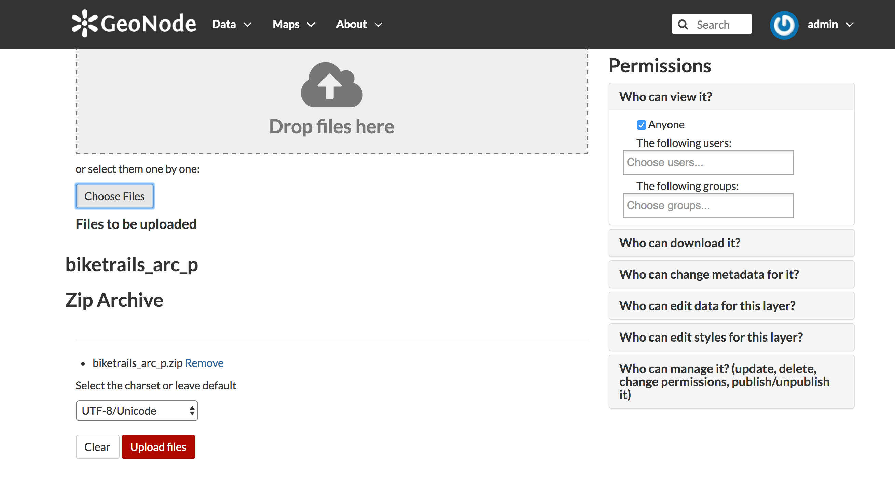

In a real use case scenario it would be possible to give granular permissions for this dataset to users or group of users. It is possible to do this using the "permissions" box.

For the purpose of this workshop we will leave default permissions for each datasets: this means that anyone will be able to see and download the datasets, but only the data owner and GeoNode administrators will be able to change the metadata, edit the styles, and administer the dataset.

Click on the "Upload Files" button. If everything works smoothly, you should see the following info box at the end of the upload process:

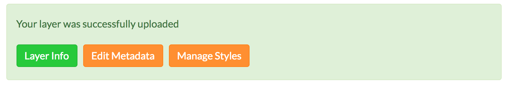

Now click on the "Layer Info" button, and you will get to the layer page.

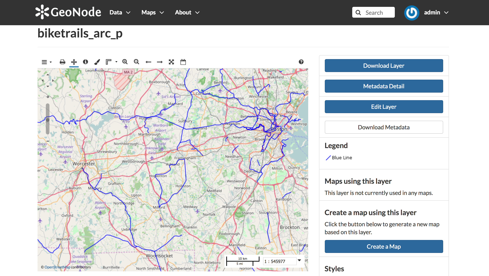

Using the map widget you can browse the layer, use the "Identify" tool to query it, change the base maps and access to the style editor.

##  Metadata edit

Now, you are going to edit some of the layer's metadata.

From the layer page, click on "Edit Layer" button, and then on "Edit Metadata" button.

Edit the *biketrails_arc_p* layer using the following information:

  * Title: "Bike Trails"
  * Abstract: "2009 MBTA bike trails"
  * Regions: "United States of America"
  * Keywords: "boston, FOSS4G2017, Commute"
  * Category: "Transportation"

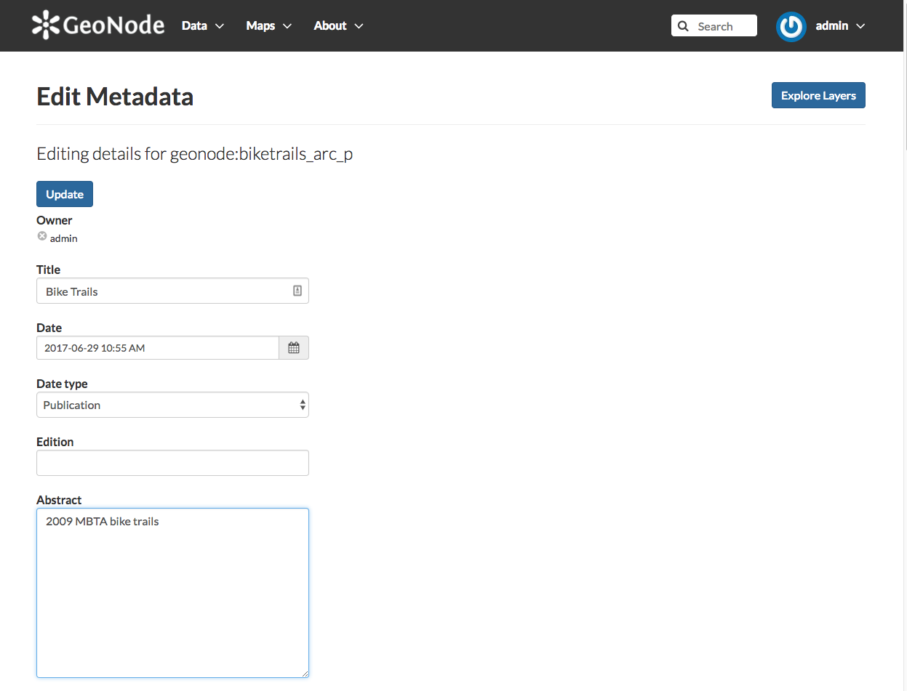

## Repeat the process for the other datasets

Repeat the upload process for each shapefile, and compile the metadata using this information:

* boston_public_schools_2012_z1l
  * Title: "Boston Public Schools (2012)"
  * Abstract: "All schools in the Boston Public Schools District (2012)"
  * Regions: "United States of America"
  * Keywords: "boston, FOSS4G2017, education, society"
  * Category: "Society"
* socioeconomic_status_2000_2014_9p1
  * Title: "Socioeconomic Status (2000 - 2014)"
  * Abstract: "Socio-economic Status Index Range"
  * Regions: "United States of America"
  * Keywords: "boston, FOSS4G2017, society, demographics, socioeconomic"
  * Category: "Society"
* subwaylines_p_odp
  * Title: "MBTA Subway Lines"
  * Abstract: "MBTA Subway Lines (Massachusetts Bay Transportation Authority)"
  * Regions: "United States of America"
  * Keywords: "boston, FOSS4G2017, transportation"
  * Category: "Transportation"

## Create a map

Now go to the layers page ("Data > Layers").

You should be able to see all of the layers. You should also be able to filter layers based on a text search, keywords, categories, regions and even date ranges.

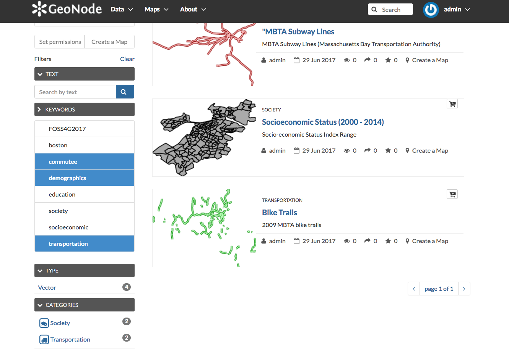

What you are going to do now it is to compose a map with these layers you just uploaded. For this purpose click on the cart icon at the right of each layer. They will be added in the cart area as in the following figure

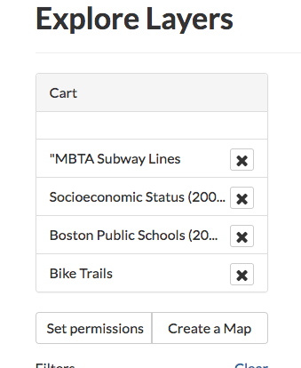

At this point click on the "Create a Map" button: the map composer, which is based on GeoExplorer, should open with the layers in the map.

Center the map in the Boston area. Then drag and drop each layer in the table of contents area, and reorder all of the layers as in the following figure

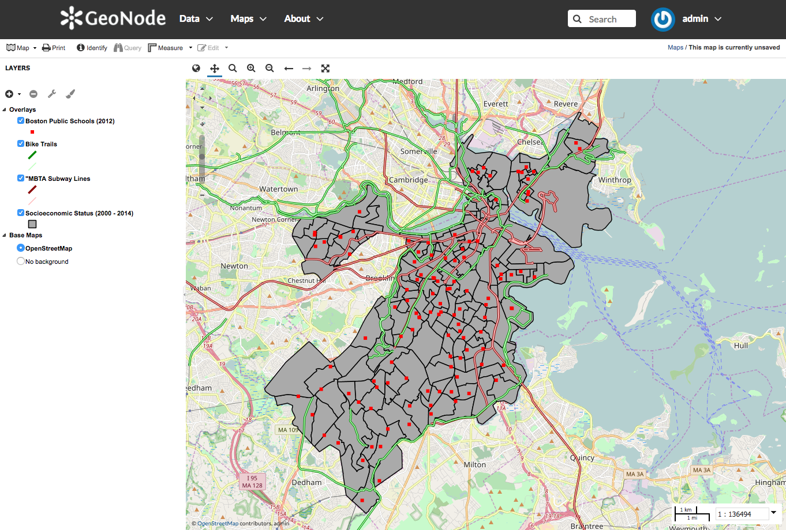

## Edit the style of the layers

Using the GeoNode map composer it is possible to edit layer styles. Let's change the style for the "MBTA Subway Lines" layer.

Right click on that layer, and press "Layer Styles". The Styles Editor widget will open.

For this layer, we will create one rule for each Boston Subway Line (Blue, Green, Orange, Red, Silver). The "MBTA Subway" layer has an attribute, named "LINE", which is set to "BLUE", "GREEN", "ORANGE", "RED", "SILVER", and that can therefore be used for this purpose.

Select the default rule (named "Blue Line" in the figure), and press the "Edit" button under it.

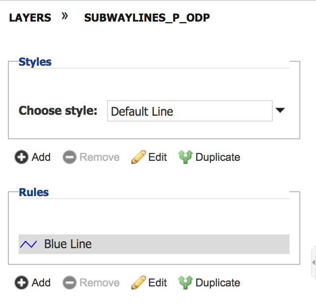

In the "Basic" tab, type "RED" in the "Name" textbox and select a Red color. As a width value, type "5".

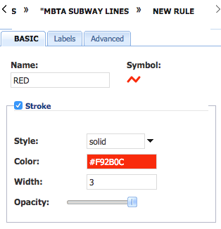

In the "Advanced" tab, check the "Limit by condition" checkbox. Then add the following condition: "LINE = RED", and save it.

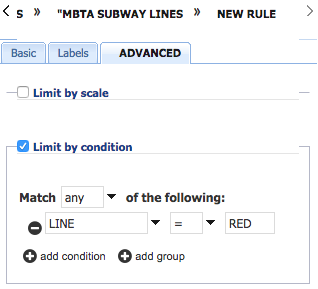

Repeat the process for the other lines. To add new rules to the default one, click on the "Add" button under the "Rules" area.

Those are all the rules which you will need to add:

* Rule name: "RED", Condition: "LINE = RED"
* Rule name: "GREEN", Condition: "LINE = GREEN"
* Rule name: "ORANGE", Condition: "LINE = ORANGE"
* Rule name: "BLUE", Condition: "LINE = BLUE"
* Rule name: "SILVER", Condition: "LINE = SILVER"

This is how the layer style should look at the end:

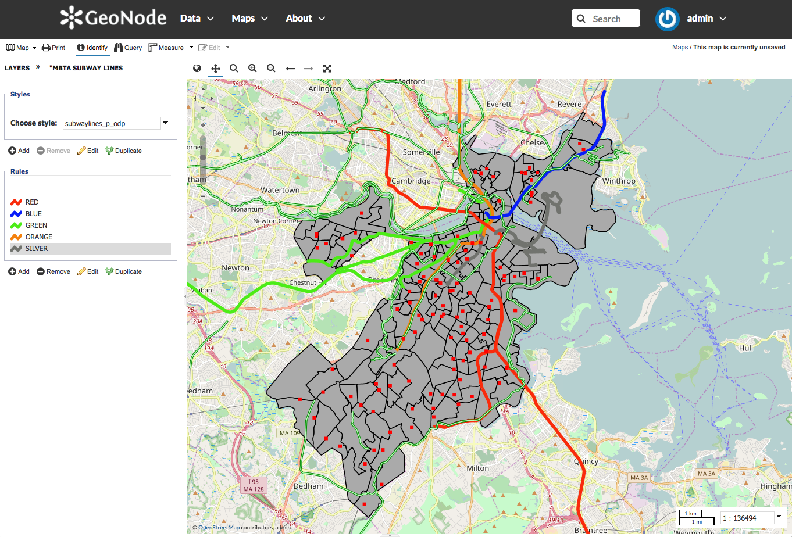

Now, using the same approach based on rules, edit the style for the "Socioeconomic Status (2000-2014)".

Create three different rules, using the attribute *SESdx14*:

Rule 1:
* Name: "Low"
* Fill Color: Red
* Match: Any of the condition
* Condition 1: "SESdx14 >= -6"
* Condition 2: "SESdx14 < -2"

Rule 2:
* Name: "Mid"
* Fill Color: Yellow
* Match: Any of the condition
* Condition 1: "SESdx14 >= -2"
* Condition 2: "SESdx14 < 1"

Rule 3:
* Name: "High"
* Fill Color: Green
* Match: Any of the condition
* Condition 1: "SESdx14 >= 1"

Finally for the layer "Bike Trails" remove one of the default two rules. Make the other rule of a purple color.

Your map should look similar to this now:

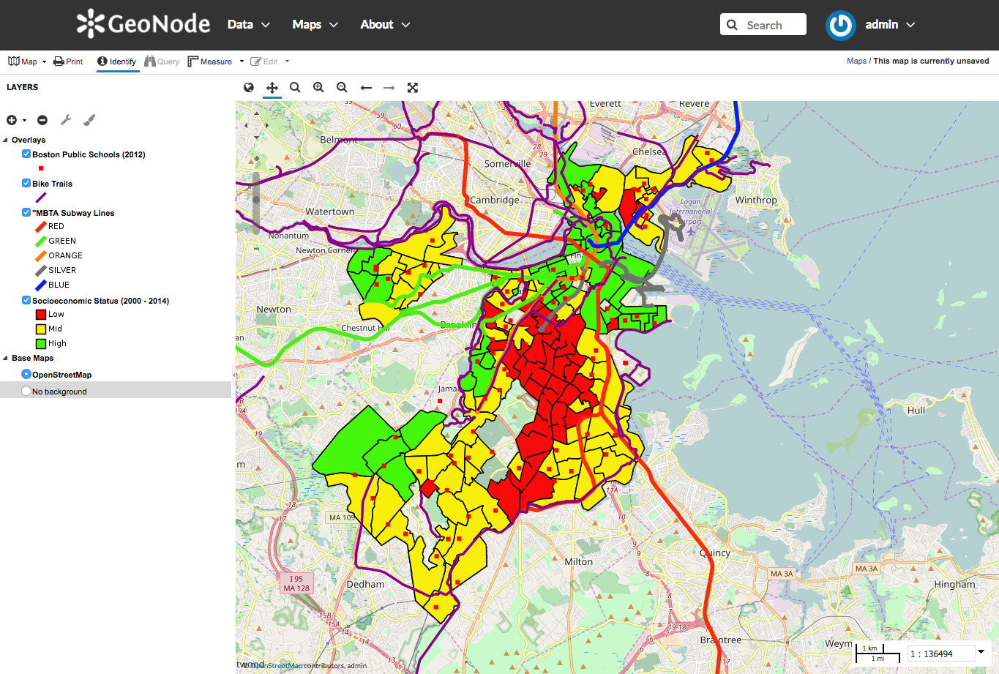

## Save the map

As a final step, do not forget to save the map by clicking on the "Map > Save Map" button.

Name the map something like "Boston Map at FOSS4G2017"
