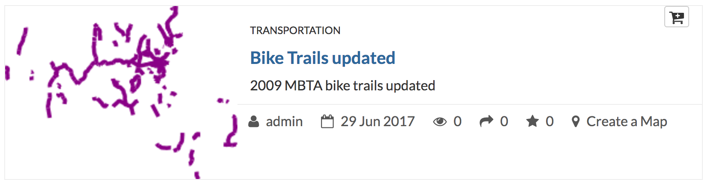

# Programming GeoNode with Python

GeoNode is built on top of [Django](https://www.djangoproject.com/), a really popular and powerful [Python](https://www.python.org/) web framework.

> Django is a high-level Python Web framework that encourages rapid development and clean, pragmatic design. Built by experienced developers, it takes care of much of the hassle of Web development, so you can focus on writing your app without needing to reinvent the wheel. It’s free and open source.

You can have a great introduction to Django using the [official Django tutorial](https://docs.djangoproject.com/en/1.11/intro/tutorial01/).

> Python is a widely used high-level programming language for general-purpose programming, created by Guido van Rossum and first released in 1991. An interpreted language, Python has a design philosophy which emphasizes code readability (notably using whitespace indentation to delimit code blocks rather than curly brackets or keywords), and a syntax which allows programmers to express concepts in fewer lines of code than might be used in languages such as C++ or Java. The language provides constructs intended to enable writing clear programs on both a small and large scale.

> Python features a dynamic type system and automatic memory management and supports multiple programming paradigms, including object-oriented, imperative, functional programming, and procedural styles. It has a large and comprehensive standard library.

In case you are new to Python, some very good resourced to get introduced to Python are:

* [A bite of Python](https://python.swaroopch.com/)
* [Google's Python Class](https://developers.google.com/edu/python/)
* [Learn Python the hard way](https://learnpythonthehardway.org/)

In this step of the workshop you will use Python to interact with GeoNode.

## Start the Django shell

A great way to start using GeoNode with Python is by using the Django shell.

In order to open it you will need to run the Django manage.py command:

```sh
$ cd /workshop/geonode/
python manage.py shell
```

You could receive an error like this:

```sh
$ python manage.py shell
Traceback (most recent call last):
  File "manage.py", line 27, in <module>
    from django.core.management import execute_from_command_line
ImportError: No module named django.core.management
```

If you receive this error message it is because you forgot to activate the virtualenv. To activate it you can do this:

```sh
$ . /workshop/env/bin/activate
```

If everything went smoothly the Django shell, based on [IPython](https://ipython.org/), should correctly open:

```sh
$ python manage.py shell
Python 2.7.12 (default, Nov 19 2016, 06:48:10)
Type "copyright", "credits" or "license" for more information.

IPython 5.4.1 -- An enhanced Interactive Python.
?         -> Introduction and overview of IPython's features.
%quickref -> Quick reference.
help      -> Python's own help system.
object?   -> Details about 'object', use 'object??' for extra details.

In [1]:
```

## Play with the Django shell

The Django shell is a very useful tool to interact with GeoNode using a programmatic approach based on Python.

Without providing too many details, GeoNode is based on three main models:

* *Layer*, a model representing a GeoNode layer
* *Map*, a model representing a GeoNode map
* *Document*, a model representing a GeoNode document

By using the GeoNode library it is possible to access to real instances of layers, maps and documents. After getting one instance it will be possible to read or even set properties of that instance.

Start trying same sample code using the Django shell. As a first step you need to import the Layer and Map models:

```python
>>> from geonode.layers.models import Layer
>>> from geonode.maps.models import Map
```

Now try to access one of the layers in your instance, and print in the terminal some of the properties:

```python
>>> layer = Layer.objects.all()[0] # get the layer
>>> print layer.title # get the layer's title
Bike Trails
>>> print layer.abstract # get the layer's abstract
2009 MBTA bike trails
>>> print layer.keywords.all() # get the layer's keywords
[<HierarchicalKeyword: FOSS4G2017>, <HierarchicalKeyword: commutee>]
>>> print layer.category # get the layer's category
Transportation
>>> print layer.region_name_list() # get the layer's regions
[u'United States of America']
>>> print layer.bbox # get the layer's bounding box
[Decimal('-73.4114198360'), Decimal('41.3945932051'), Decimal('-69.9476115692'), Decimal('42.8701268874'), u'EPSG:4326']
>>> print layer.get_thumbnail_url() # get the layer's thumbnail
http://localhost:8000/uploaded/thumbs/layer-cda5c5ae-5cfa-11e7-8103-02d8e4477a33-thumb.png
>>> print layer.owner, layer.metadata_author, layer.poc # get the layer's owner, metadata author and point of contact
admin admin admin
```
In the next code block, you iterate the layer's attributes (fields) to get their name, type and label:

```python
>>> for attribute in layer.attributes:
>>>     print attribute.attribute, attribute.attribute_type, attribute.attribute_label

TRAIL_STAT xsd:string Status of the trail
OWNER xsd:string Owner
PREV_OWNER xsd:string Previous Owner
MANAGER xsd:string Manager
STATUS_OWN xsd:string Status of owner
STATUS_MAN xsd:string Status of manager
TRAILNAME xsd:string Name of the trail
...
```

Using the same approach you followed for the layer, you can programmatically get to the map you previously created:

```python
>>> map = Map.objects.all()[0] # get the map
>>> print map.title # get the map's title
Boston Map at FOSS4G2017
>>> print map.abstract # get the map's abstract
A Boston map created for the FOSS4G 2017 GeoNode and Solr Workshop
>>> print map.bbox # get the map's bounding box
[Decimal('-71.2196746791'), Decimal('42.3222257127'), Decimal('-70.8763491837'), Decimal('42.2978876546'), u'EPSG:4326']
>>> print map.get_thumbnail_url() # get the map's thumbnail url
http://localhost:8000/uploaded/thumbs/map-3b90f64a-5d11-11e7-8103-02d8e4477a33-thumb.png
>>> print map.owner, map.metadata_author, map.poc # get the map's owner, metadata author and point of contact
admin admin admin
>>> print len(map.layers) # get the map's number of layers (this count includes basemap layers)
6
```

## Using Python to update layer's metadata

The Django shell can be used to programmatically update the metadata of a layer or a map. Here is what you can do to change the title and the abstract of a layer:

```python
>>> layer = Layer.objects.all()[0]
>>> layer.title = 'Bike Trails updated'
>>> layer.abstract = '2009 MBTA bike trails updated'
>>> layer.save()
```

If now you open the layers page, you should see the metadata for the title and abstract correctly updated:



As a bonus step, try to change the title and abstract of the map you created.

## Using Python to read layer's features

GeoNode comes with GDAL and its Python bindings installed. [GDAL](http://www.gdal.org/) is a great toolset and library to interact with a plethora of geospatial formats.

> The Geospatial Data Abstraction Library (GDAL) is a computer software library for reading and writing raster and vector geospatial data formats, and is released under the permissive X/MIT style free software license by the Open Source Geospatial Foundation. As a library, it presents a single abstract data model to the calling application for all supported formats. It may also be built with a variety of useful command line interface utilities for data translation and processing. Projections and transformations are supported by the PROJ.4 library.

>The related OGR library (OGR Simple Features Library), which is part of the GDAL source tree, provides a similar ability for simple features vector graphics data. GDAL was developed mainly by Frank Warmerdam until the release of version 1.3.2, when maintenance was officially transferred to the GDAL/OGR Project Management Committee under the Open Source Geospatial Foundation.

> GDAL/OGR is considered a major free software project for its "extensive capabilities of data exchange" and also in the commercial GIS community due to its widespread use and comprehensive set of functionalities.

Here you will use the GDAL Python bindings to read the "Boston Public Schools (2012)" shapefile store in GeoNode/GeoServer.

```python
>>> from osgeo import ogr
>>> schools_shapefile = "/vagrant/geonode/geonode/uploaded/layers/boston_public_schools_2012_z1l.shp"
>>> driver = ogr.GetDriverByName('ESRI Shapefile')
>>> data_source = driver.Open(schools_shapefile, 0) # 0 means read only
>>> shp_layer = data_source.GetLayer() # shapefiles have just one layer
>>> for feature in shp_layer:
>>>   print feature.GetField("City"), feature.GetField("School_Nam"), feature.GetGeometryRef().ExportToWkt()

East Boston Adams Elementary POINT (238299.659967332147062 901795.889980231411755)
Brighton Another Course to College POINT (229148.81013232798432 900003.229980574804358)
Brighton Baldwin ELC POINT (229615.22020976812928 899151.699935027398169)
...
```

You can check the shapefile data store path using the GeoServer administrative interface or the *locate* Linux command. If you didn't customize things it should be */vagrant/geonode/geonode/uploaded/layers/boston_public_schools_2012_z1l.shp*

A GDAL vector data store can be accessed using OGR. OGR has different drivers for different data formats. In your case the vectore dataset has been uploaded to GeoServer as a shapefile, therefore you can read it using the 'ESRI Shapefile' driver.

Each OGR dataset can be composed by different layers. Shapefiles are composed by just one layer.

In the previous code you are iterating all of the features of the default shapefile layer in order to print the feature's values for the "City" and "School_Nam" fields, and the WKT representation of the feature's geometry.

If you are interested in getting more information about the GDAL Python bindings, two great resources are:

* [The Python GDAL/OGR Cookbook](https://pcjericks.github.io/py-gdalogr-cookbook/)
* [GeoProcessing with Python](https://www.amazon.com/Geoprocessing-Python-Chris-Garrard/dp/1617292141/ref=sr_1_2?ie=UTF8&qid=1498847107&sr=8-2&keywords=gdal)

NOTE: Another way to use GDAL with Python is with the [Fiona](http://toblerity.org/fiona/manual.html) libary. Fiona is often used with [Shapely](http://toblerity.org/shapely/), which comes with GeoNode.
