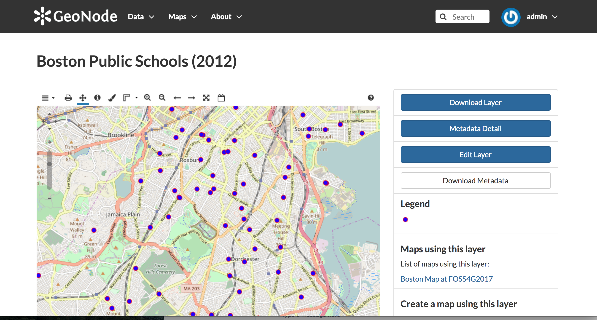
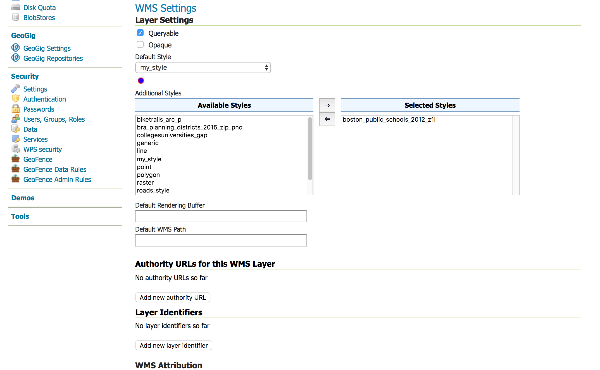

# OGC Services with GeoServer

Any SDI and geoportal needs to implement OGC Web Services (OWS) and specifications such as:

* [OGC Web Map Service Standard, WMS](http://www.opengeospatial.org/standards/wms)
* [OGC Web Feature Service Standard, WFS](http://www.opengeospatial.org/standards/wfs)
* [OGC Transactional Web Feature Service Standard, WFS-T](http://www.opengeospatial.org/standards/wfs)
* [OGC Web Coverage Service Standard, WCS](http://www.opengeospatial.org/standards/wcs)
* [OGC Web Processing Server Standard, WPS](http://www.opengeospatial.org/standards/wps)
* [OGC Web Map Tile Service Standard, WMTS](http://www.opengeospatial.org/standards/wmts)
* [OSGeo Tile Map Service Specification, TMS](https://wiki.osgeo.org/wiki/Tile_Map_Service_Specification)
* [OSGeo WMS Tile Caching Specification, WMS-C](https://wiki.osgeo.org/wiki/WMS_Tile_Caching) (*)
* [OGC Catalogue Service, CSW](http://www.opengeospatial.org/standards/cat)

(*) superceded by OSGeo TMS and OGC WMTS

All of this services are provided in GeoNode by its underlying components: [GeoServer](http://geoserver.org/), [GeoWebCache](http://www.geowebcache.org/) and [pycsw](http://pycsw.org/).
It is possible to use [GeoNetwork](http://geonetwork-opensource.org/) in place of pycsw, in case it is needed, by changing the GeoNode default configuration.

GeoServer implements WMS, WFS, WCS, WPS. GeoWebCache implements all of the cache map tiles services: TMS, WMS-C, WMTS. pycsw, or GeoNetwork, implements CSW.

GeoNode, in its end user standard interface, right now makes use of just WMS, WFS, WFS-T, WMS-C and CSW.

WMS, WFS and WFS-T services are provided by GeoServer. WMS-C services are provided by GeoWebCache, as you will see in the next workshop's tutorial. CSW services are provided, as you will see in a following workshop's tutorial, by pycsw.

In this tutorial you will take a quick tour of the GeoServer administrative interface and you will have an overview of the GeoServer OGC services used by GeoNode: WMS and WFS. Then you will expore the GeoServer REST API, which provides to GeoNode the way to interact with GeoServer when it is not possible to use OGC services (OWS) standard calls.

You will also use [OWSLib](https://geopython.github.io/OWSLib/), a Python library for interacting with OWS, in order to use these service with the Python language.

Before starting, make sure GeoNode and GeoServer are up and running at: http://localhost:8000/ and http://localhost:8080/geoserver/
Make sure you are logged in both of them.

If GeoNode/GeoServer are not running, activate the virtualenv, start geoserver and run the Django development server:

```sh
$ cd /workshop/
$ . env/bin/activate
$ paver start_geoserver
$ ./manage.py runserver 0.0.0.0:8000
```

## An overview of the GeoServer web administration interface

GeoServer has a browser-based web administration interface application used to configure all aspects of GeoServer, from adding and publishing data to changing service settings.

When accessing the home page of the GeoServer administrative site, using the url http://localhost:8080/geoserver (or from the GeoNode user menu), on the right side you will see a list of supported standard and specifications


Clicking on each service capabilities link you will access the capabilities document for the given service type.

A quickstart for using the GeoServer web administration interface can be found [here](http://docs.geoserver.org/latest/en/user/gettingstarted/web-admin-quickstart/index.html). For the purpose of the workshop, takes some minutes to explore the main sections of the GeoServer administrative interface which can be useful when using it with GeoNode. You can access to these sections by clicking on the menu items on the left of the GeoServer page.

**Server Status** provides a summary of the server configuration and status. From this page it is possible to see the location of the GeoServer data directory, the connections and memory used, the JVM Version and many other information


**GeoServer Logs** provides the log tail of the GeoServer servlet process. Obviously it is possible to access to it from the shell using linux commands such as *tail* and *less*


**GeoServer Contact Information** provides a form to set the contact information of the server. This information is used in the metadata provided by the WMS, WCS and WFS GetCapabilities documents.


**Layer Preview** provides a convenient interface for exploring the layers which have been uploaded to GeoNode/GeoServer. It is possible to browse layers using the OpenLayers viewer, or getting the WMS/WFS response in a specific format


**Workspaces** Analogous to a namespace, a workspace is a container which organizes other items. In GeoServer, a workspace is often used to group similar layers together. By default GeoNode use a workspace named *geonode*, and all of the stores and layers are created within that workspace


**Stores** A store connects to a data source that contains raster or vector data. A data source can be a file or group of files, a table in a database, a single raster file, or a directory. GeoNode by default will create a GeoTIFF store for each uploaded raster dataset and a Shapefile store for each uploaded vector dataset. It is possible to configure GeoNode to use one or more PostGIS databases and have the vector dataset uploaded as a table in the database. Furthermore, it is possible to use in GeoNode any datasource supported by GeoServer by registering the GeoServer layer in GeoNode with the *updatelayers* management command


**Layers** provides a view of all of the layers contained in the GeoServer data directory. Layers can be raster or vector datasets. Each layer has a source of data, the *store*, which is associated with the *workspace* in which the store is defined. As you can see the layers you have uploaded to GeoNode are all part of the *geonode namespace*, and for each one a shapefile store was created


**Styles** provides a view of all of the styles associated (or not) to the layers. By default there is at least one style associated to a layer, which is the default style. One layer can have multiple styles associated to it. Styles can be created using the GeoExplorer interface of GeoNode or the GeoServer admin interface


**WMTS**, **WCS**, **WFS**, **WMS**, **WPS** provide forms to set the services metadata such as the maintainer, title, abstract and other info. One important thing that can be done from this forms is to enable/disable these services at global level (ie: for all of the layers).


**Global Settings** provides a way to alter global GeoServer settings, such as the logging level, the behavior with misconfigured layers, the number of decimals to include in output and many others


**Tile Caching** you will be back to this in the next workshop tutorial, when you will have a look at GeoWebCache.

**Security** when using GeoServer with GeoNode you shouldn't need to interact with this part of the GeoServer administrative site.

## A gentle introduction to the WMS and WFS OGC standards

In this step of the tutorial you will explore the WMS and WFS OGC standards provided by GeoServer.

### WMS

> The OGC Web Map Service (WMS) specification defines an HTTP interface for requesting georeferenced map images from a server. GeoServer supports WMS 1.1.1, the most widely used version of WMS, as well as WMS 1.3.0.

> WMS provides a standard interface for requesting a geospatial map image. The benefit of this is that WMS clients can request images from multiple WMS servers, and then combine them into a single view for the user. The standard guarantees that these images can all be overlaid on one another as they actually would be in reality. Numerous servers and clients support WMS.

For an extended reference to the WMS standard in GeoServer check the [GeoServer WMS reference documentation](http://docs.geoserver.org/latest/en/user/services/wms/reference.html)

GeoServer implements the following WMS Operations (the last three ones are optional for this standard, but implemented in GeoServer):

* **GetCapabilities**: 	Retrieves metadata about the service, including supported operations and parameters, and a list of the available layers
* **GetMap**: Retrieves a map image for a specified area and content
* **GetFeatureInfo**: Retrieves the underlying data, including geometry and attribute values, for a pixel location on a map
* **DescribeLayer**: Indicates the WFS or WCS to retrieve additional information about the layer
* **GetLegendGraphic**: Retrieves a generated legend for a map
* **GetStyles**: Retrieves a list of styles associated to a layer

All of these WMS operations are used in GeoNode, and you will see how soon: *GetCapabilities* is used to retrieve service and layer metadata, *GetMap* is used any time the GeoNode user update the layers's view in the map composer (GeoExplorer) or in the layer details page, *GetFeatureInfo* is used any time the GeoNode user identify one or more features from the map composer, *DescribeLayer* is used by the style editor, *GetLegendGraphic* is used to generate the legend elements in the GeoExplorer table of contents, *GetStyles* is used to retrieve the styles associated to a layer

#### GetCapabilities

To see how the WMS GetCapabilities request is composed, and the result of its output, you can click on this link (which is the same link you find in the GeoServer home page for WMS 1.3.0): http://localhost:8080/geoserver/ows?service=wms&version=1.3.0&request=GetCapabilities

Spend some minutes to observe the XML response of this request: you should recognize:

* an initial section with metadata related to the WMS server: name, title, abstract, keywords, contact information). All of these information may be changed using the GeoServer administrative site
* a section with supported operations: GetCapabilities, GetMap (with the supported output formats), GetFeatureInfo (with the supported output formats)
* a sections with all of the exposed layers and the supported spatial reference system. For each layer the GetCapabilities document returns the name, title, abstract, keywords, bounding box, attribution informations and styles

You should see the four layers which you have uploaded so far to GeoNode, and all of the metadata you compiled.

Now you will use the OWSLib Python library to parse the GetCapabilities document of your GeoNode instance in order to get metadata information about your instance and its layers. Open a new shell, log in the vagrant box, activate the virtualenv and run the Django shell:

```sh
✗ vagrant ssh
$ . /workshop/env/bin/activate
$ cd /workshop/geonode/
$ python manage.py shell
```

Now using Python and OWSLib open the GeoNode WMS endpoint and check its basic metadata:

```python
>>> from owslib.wms import WebMapService
>>> wms = WebMapService('http://localhost:8080/geoserver/ows?') # open GeoNode WMS endpoint
>>> print wms.identification.title # you can change this and the following metadata from GeoServer admin site
My GeoServer WMS
>>> print wms.identification.abstract
This is a description of your Web Map Server.
>>> print wms.identification.keywords
['WFS', 'WMS', 'GEOSERVER']
>>>
```

 Print the WMS supported operation names:

```python
>>> for operation in wms.operations:
        print operation.name # print each WMS operation name

GetCapabilities
GetMap
GetFeatureInfo
DescribeLayer
GetLegendGraphic
GetStyles
```

List service's layers:

```python
>>> list(wms.contents)
['geonode:biketrails_arc_p',
 'geonode:boston_public_schools_2012_z1l',
 'geonode:socioeconomic_status_2000_2014_9p1',
 'geonode:subwaylines_p_odp']
```

Print main information of a layer:

```python
>>> layer = wms['geonode:biketrails_arc_p']
>>> print layer.title
Bike Trails updated
>>> print layer.name
geonode:biketrails_arc_p
>>> print layer.abstract
2009 MBTA bike trails updated
>>> print layer.keywords
['FOSS4G2017', 'commutee']
>>> print layer.boundingBox
(-73.41141983595836, 41.394593205113374, -69.94761156918418, 42.87012688741449, 'EPSG:4326')
```

#### GetMap

The GetMap request can be used to request the WMS endpoint of GeoServer to generate a map. GeoNode use behind the scenes GetMap requests to GeoServer to provide maps to the end users. By default GeoNode, for performance reasons, cache the output of these requests with GeoWebCache, but this beahviour can be changed from the GeoServer administrative interface.

In a WMS GetMap request there are several parameters which are involved, a complete list is [here](http://docs.geoserver.org/stable/en/user/services/wms/reference.html#getmap).

The required parameters for a GetMap request are:

* **service**: always *WMS*
* **version**: Value is one of *1.0.0*, *1.1.0*, *1.1.1*, *1.3.0*
* **request**: always *GetMap*
* **layers**: layers to display on map (comma-separated list of layer names)
* **styles**: styles to use in the map. If empty it uses default styles
* **srs** of **crs**: Spatial Reference System to use in map output, using the EPSG:nnn format
* **bbox** bounding box of the map extent, in the format minx,miny,maxx,maxy
* **width** width of map output in pixels
* **height** height of map output in pixels
* **format** image format for map output

For example here is a GetMap to get a map image of the "Socioeconomic Status (2000-2014)" layer (click on the link to see it): http://localhost:8080/geoserver/wms?LAYERS=geonode%3Asocioeconomic_status_2000_2014_9p1&SERVICE=WMS&VERSION=1.1.1&REQUEST=GetMap&STYLES=&FORMAT=image%2Fpng&SRS=EPSG%3A900913&BBOX=-7915207,5209947,-7910315,5214839&WIDTH=256&HEIGHT=256

An useful way to build a WMS GetMap request for a layer is by using the GeoServer Layer Preview interface. Go to the GeoServer admin page (http://localhost:8080/geoserver), then click on the *Data > Layer Preview* menu.

Select the layer for which you want to build the WMS GetMap, a format and then the browser will open a new page with the GetMap request in the url


Get back now to the Django shell, and you will use OWSLib to perform the same WMS GetMap request programmatically by using Python:

```python
>>> from owslib.wms import WebMapService
>>> wms = WebMapService('http://localhost:8080/geoserver/ows?')
>>> img = wms.getmap(
   ...:     layers=['geonode:socioeconomic_status_2000_2014_9p1'],
   ...:     srs='EPSG:900913',
   ...:     bbox=(-7915207,5209947,-7910315,5214839),
   ...:     size=(256, 256),
   ...:     format='image/png'
   ...: )
>>> out_img = open('/workshop/test_get_map.png', 'wb')
>>> out_img.write(img.read())
>>> out_img.close()
```

Make sure your image has been correctly generated at */workshop/test_get_map.png*. You can easily open it on your host OS by going to the directory where you cloned the workshop repository.

#### GetFeatureInfo

The GeoServer WMS GetFeatureInfo request is used by GeoNode to return the spatial and attribute data for the features at a given location on a map. For this purpose an alternative could be to use the WFS GetFeatureInfo request, but the GetMap GetFeatureInfo request provide the advantage that request uses an (x, y) pixel value from a returned WMS image.

In a WMS GetFeatureInfo request there are several parameters which are involved, a complete list is [here](http://docs.geoserver.org/stable/en/user/services/wms/reference.html#getfeatureinfo).

The required parameters for a GetFeatureInfo request are very similar to the ones you have used for the GetMap request. Differences are:

* **request**: always *GetFeatureInfo*
* **query_layers**: a comma-separated list of one or more layers to query
* **x** or **i**: X ordinate of query point on map, in pixels. 0 is left side. i is the parameter key used in WMS 1.3.0
* **y** or **j**: Y ordinate of query point on map, in pixels. 0 is the top. j is the parameter key used in WMS 1.3.0
* **info_format**: Format of the response, can be TEXT, GML2, GML3, HTML, JSON, JSONP. This is optional, default is TEXT

Here is a sample GetFeatureInfo request to the socioeconomic_status_2000_2014_9p1 layer. Click on the link to check the GeoServer response:

http://localhost:8080/geoserver/wms?LAYERS=geonode:socioeconomic_status_2000_2014_9p1&QUERY_LAYERS=geonode:socioeconomic_status_2000_2014_9p1&SERVICE=WMS&VERSION=1.1.1&REQUEST=GetFeatureInfo&BBOX=-7921478,5202230,-7900993,5214785&HEIGHT=657&WIDTH=1072&FORMAT=image/png&INFO_FORMAT=application/json&SRS=EPSG:900913&X=489&Y=376

#### DescribeLayer

GeoExplorer, the client in GeoNode, needs to know the structure of the data, for example to implement the style editor widget and the query widget. This is done using a WMS DescribeLayer to GeoServer.

The required parameters are:

* **service**: always *WMS*
* **version**: Value is one of *1.0.0*, *1.1.0*, *1.1.1*, *1.3.0*
* **request**: always *DescribeLayer*
* **layers**: layers to query (comma-separated list of layer names)

Here is a sample DescribeLayer request to the socioeconomic_status_2000_2014_9p1 layer. Click on the link to check the GeoServer response:

http://localhost:8080/geoserver/wms?LAYERS=geonode%3Asocioeconomic_status_2000_2014_9p1&SERVICE=WMS&VERSION=1.1.1&REQUEST=DescribeLayer&outputFormat=text/xml

The output will return the GeoServer service type (WFS for vector layers, WCS for coverage) endpoint to use for getting more information about the layer.

In this case it is a WFS. Later in this tutorial you will have a look at how to interact with WFS in GeoServer.

#### GetLegendGraphic

The WMS GetLegendGraphic operation is used by GeoNode to generate the legends in the map composer and in the layer page.

Here is the GetLegendGraphic request for the "Socioeconomic Status (200-2014)" layer:

http://localhost:8080/geoserver/wms?TRANSPARENT=TRUE&SERVICE=WMS&VERSION=1.1.1&REQUEST=GetLegendGraphic&TILED=true&LAYER=geonode:socioeconomic_status_2000_2014_9p1&transparent=true&format=image/png

GetLegendGraphic supports a large number of parameters and options to let a client to generate a great legend graphic. For a full list you can have a read [here](http://docs.geoserver.org/stable/en/user/services/wms/get_legend_graphic/index.html#get-legend-graphic)


#### GetStyles

The WMS GetStyles operation is used by GeoNode to retrieve the list of styles associated to a layer.

Here is the GetStyles request for the "Socioeconomic Status (200-2014)" layer:

http://localhost:8080/geoserver/wms?SERVICE=WMS&VERSION=1.1.1&REQUEST=GetStyles&LAYERS=geonode:socioeconomic_status_2000_2014_9p1

### WFS

> The Web Feature Service (WFS) is a standard created by the Open Geospatial Consortium (OGC) for creating, modifying and exchanging vector format geographic information on the Internet using HTTP. A WFS encodes and transfers information in Geography Markup Language (GML), a subset of XML. The current version of WFS is 2.0.0. GeoServer supports versions 2.0.0, 1.1.0, and 1.0.0. Although there are some important differences between the versions, the request syntax often remains the same.

> The WFS standard defines the framework for providing access to, and supporting transactions on, discrete geographic features in a manner that is independent of the underlying data source. Through a combination of discovery, query, locking, and transaction operations, users have access to the source spatial and attribute data in a manner that allows them to interrogate, style, edit (create, update, and delete), and download individual features. The transactional capabilities of WFS also support the development and deployment of collaborative mapping applications.

For an extended reference to the WFS standard in GeoServer check the [GeoServer WFS reference documentation](http://docs.geoserver.org/latest/en/user/services/wfs/reference.html)

GeoNode uses the version 1.1.0 of the WFS standard, for which GeoServer implements the following operations (the last three ones are optional for this standard, but implemented in GeoServer):

* **GetCapabilities** retrieves metadata about the service, including supported operations and parameters, and a list of the available vector layers
* **DescribeFeatureType** returns a description of feature types supported by a WFS service
* **GetFeature** returns a selection of features from a data source including geometry and attribute values
* **LockFeature** prevents a feature from being edited through a persistent feature lock
* **Transaction** edits existing feature types by creating, updating, and deleting

GeoNode implements all of these operations but not the LockFeature: *GetCapabilities* is used to retrieve service and layers metadata, *DescribeFeatureType* is used by the style editor to read the information of the layer attributes (field name, type...), *GetFeature* is used when downloading the dataset,by the query builder and by the identify tool, *Transaction* is used when interacting with the editing tools.

#### GetCapabilities

You can see the WFS GetCapabilities response using this link:

http://localhost:8080/geoserver/ows?service=wfs&version=1.1.0&request=GetCapabilities

Spend some time inspecting the content of the output of this request. You should recognize:

* an initial session with ServiceIdentification: this contains the metadata of the WFS service
* a session with ServiceProvider: this provides metadata related to the contact point
* a session with supported operations
* finally a session containing all of the GeoServer vector layers you uploaded. For each layer are provided metadata such as the layer's name, title, abstract, keywords, default SRS and the bounding box

As you did with WMS, try to use OWSLib with Python to get to these metadata:

```python
>>> from owslib.wfs import WebFeatureService
>>> wfs = WebFeatureService(url='http://localhost:8080/geoserver/ows?', version='1.1.0')
>>> print wfs.identification.title
My GeoServer WFS
>>> print wfs.identification.abstract
This is a description of your Web Feature Server.
...
>>> print wfs.identification.keywords
['WFS', 'WMS', 'GEOSERVER']
```

Print the WFS supported operation names:

```python
>>> for operation in wfs.operations:
      print operation.name    
GetCapabilities
DescribeFeatureType
GetFeature
GetGmlObject
LockFeature
GetFeatureWithLock
Transaction
```

List the service's layers:

```python
>>> list(wfs.contents)
['geonode:boston_public_schools_2012_z1l',
 'geonode:biketrails_arc_p',
 'geonode:socioeconomic_status_2000_2014_9p1',
 'geonode:subwaylines_p_odp']
```

Get the metadata of a layer:

```python
>>> layer = wfs['geonode:subwaylines_p_odp']
>>> print layer.id
geonode:subwaylines_p_odp
>>> print layer.title
"MBTA Subway Lines
>>> print layer.abstract
MBTA Subway Lines (Massachusetts Bay Transportation Authority)
>>> print layer.keywords
['FOSS4G2017', 'boston', 'transportation']
>>> print layer.boundingBoxWGS84
(-71.25301493328648, 42.207496931441305, -70.99102173442837, 42.437486977030176)
```

#### DescribeFeatureType

DescribeFeatureType returns a description of feature types supported by a WFS service

http://localhost:8080/geoserver/wfs?SERVICE=WFS&REQUEST=DescribeFeatureType&TYPENAME=geonode%3Asocioeconomic_status_2000_2014_9p1

Response:

```xml

<?xml version="1.0" encoding="UTF-8"?>
<xsd:schema xmlns:xsd="http://www.w3.org/2001/XMLSchema" xmlns:geonode="http://www.geonode.org/" xmlns:gml="http://www.opengis.net/gml/3.2" xmlns:wfs="http://www.opengis.net/wfs/2.0" elementFormDefault="qualified" targetNamespace="http://www.geonode.org/">
  <xsd:import namespace="http://www.opengis.net/gml/3.2" schemaLocation="http://localhost:8080/geoserver/schemas/gml/3.2.1/gml.xsd?access_token=hVXyQgufzQc4nkDfI4sul9TihL1lHa"/>
  <xsd:complexType name="socioeconomic_status_2000_2014_9p1Type">
    <xsd:complexContent>
      <xsd:extension base="gml:AbstractFeatureType">
        <xsd:sequence>
          <xsd:element maxOccurs="1" minOccurs="0" name="the_geom" nillable="true" type="gml:MultiSurfacePropertyType"/>
          <xsd:element maxOccurs="1" minOccurs="0" name="CT_ID_1" nillable="true" type="xsd:string"/>
          <xsd:element maxOccurs="1" minOccurs="0" name="GEOID10" nillable="true" type="xsd:string"/>
          <xsd:element maxOccurs="1" minOccurs="0" name="ALAND10" nillable="true" type="xsd:int"/>
          <xsd:element maxOccurs="1" minOccurs="0" name="AWATER1" nillable="true" type="xsd:int"/>
          <xsd:element maxOccurs="1" minOccurs="0" name="POP100" nillable="true" type="xsd:double"/>
          <xsd:element maxOccurs="1" minOccurs="0" name="HU100" nillable="true" type="xsd:double"/>
          <xsd:element maxOccurs="1" minOccurs="0" name="Type" nillable="true" type="xsd:string"/>
          <xsd:element maxOccurs="1" minOccurs="0" name="Res" nillable="true" type="xsd:double"/>
          <xsd:element maxOccurs="1" minOccurs="0" name="BRA_PD_" nillable="true" type="xsd:int"/>
          <xsd:element maxOccurs="1" minOccurs="0" name="BRA_PD" nillable="true" type="xsd:string"/>
          <xsd:element maxOccurs="1" minOccurs="0" name="Cty_Cnc" nillable="true" type="xsd:int"/>
          <xsd:element maxOccurs="1" minOccurs="0" name="WARD" nillable="true" type="xsd:int"/>
          <xsd:element maxOccurs="1" minOccurs="0" name="ISD_Nbh" nillable="true" type="xsd:string"/>
          <xsd:element maxOccurs="1" minOccurs="0" name="Polc_Ds" nillable="true" type="xsd:int"/>
          <xsd:element maxOccurs="1" minOccurs="0" name="Fr_Dstr" nillable="true" type="xsd:int"/>
          <xsd:element maxOccurs="1" minOccurs="0" name="PWD" nillable="true" type="xsd:string"/>
          <xsd:element maxOccurs="1" minOccurs="0" name="HI00" nillable="true" type="xsd:double"/>
          <xsd:element maxOccurs="1" minOccurs="0" name="MR00" nillable="true" type="xsd:double"/>
          <xsd:element maxOccurs="1" minOccurs="0" name="HI10" nillable="true" type="xsd:int"/>
          <xsd:element maxOccurs="1" minOccurs="0" name="MR10" nillable="true" type="xsd:int"/>
          <xsd:element maxOccurs="1" minOccurs="0" name="HI00_10" nillable="true" type="xsd:double"/>
          <xsd:element maxOccurs="1" minOccurs="0" name="MR00_10" nillable="true" type="xsd:double"/>
          <xsd:element maxOccurs="1" minOccurs="0" name="HI14" nillable="true" type="xsd:int"/>
          <xsd:element maxOccurs="1" minOccurs="0" name="MR14" nillable="true" type="xsd:int"/>
          <xsd:element maxOccurs="1" minOccurs="0" name="HI10_14" nillable="true" type="xsd:double"/>
          <xsd:element maxOccurs="1" minOccurs="0" name="MR10_14" nillable="true" type="xsd:double"/>
          <xsd:element maxOccurs="1" minOccurs="0" name="SESdx00" nillable="true" type="xsd:double"/>
          <xsd:element maxOccurs="1" minOccurs="0" name="SES00tr" nillable="true" type="xsd:string"/>
          <xsd:element maxOccurs="1" minOccurs="0" name="SESdx10" nillable="true" type="xsd:double"/>
          <xsd:element maxOccurs="1" minOccurs="0" name="SES10tr" nillable="true" type="xsd:string"/>
          <xsd:element maxOccurs="1" minOccurs="0" name="SESdx14" nillable="true" type="xsd:double"/>
          <xsd:element maxOccurs="1" minOccurs="0" name="SES14tr" nillable="true" type="xsd:string"/>
          <xsd:element maxOccurs="1" minOccurs="0" name="SES00_1" nillable="true" type="xsd:double"/>
          <xsd:element maxOccurs="1" minOccurs="0" name="SES10_1" nillable="true" type="xsd:double"/>
        </xsd:sequence>
      </xsd:extension>
    </xsd:complexContent>
  </xsd:complexType>
  <xsd:element name="socioeconomic_status_2000_2014_9p1" substitutionGroup="gml:AbstractFeature" type="geonode:socioeconomic_status_2000_2014_9p1Type"/>
</xsd:schema>
```

#### GetFeature

The request parameters for GetFeature are sent with a POST HTTP Request to the WFS endpoint (typically http://localhost:8080/geoserver/wfs?).

Request:

```xml
<wfs:GetFeature xmlns:wfs="http://www.opengis.net/wfs" service="WFS" version="1.1.0" maxFeatures="20" xsi:schemaLocation="http://www.opengis.net/wfs http://schemas.opengis.net/wfs/1.1.0/wfs.xsd" xmlns:xsi="http://www.w3.org/2001/XMLSchema-instance">
  <wfs:Query typeName="feature:collegesuniversities_gap" srsName="EPSG:900913" xmlns:feature="http://www.geonode.org/">
    <ogc:Filter xmlns:ogc="http://www.opengis.net/ogc"><ogc:FeatureId fid="collegesuniversities_gap.47"/></ogc:Filter>
  </wfs:Query>
</wfs:GetFeature>
```

Response:

```xml
<?xml version="1.0" encoding="UTF-8"?>
<wfs:FeatureCollection xmlns:xs="http://www.w3.org/2001/XMLSchema" xmlns:wfs="http://www.opengis.net/wfs" xmlns:gml="http://www.opengis.net/gml" xmlns:geonode="http://www.geonode.org/" xmlns:ogc="http://www.opengis.net/ogc" xmlns:ows="http://www.opengis.net/ows" xmlns:xlink="http://www.w3.org/1999/xlink" xmlns:xsi="http://www.w3.org/2001/XMLSchema-instance" numberOfFeatures="1" timeStamp="2017-07-11T20:13:06.104Z" xsi:schemaLocation="http://www.geonode.org/ http://localhost:8080/geoserver/wfs?service=WFS&amp;version=1.1.0&amp;request=DescribeFeatureType&amp;typeName=geonode%3Acollegesuniversities_gap&amp;access_token=0UF2WuHEDd1EsprnsWM1xoE4UOfzgd http://www.opengis.net/wfs http://localhost:8080/geoserver/schemas/wfs/1.1.0/wfs.xsd?access_token=0UF2WuHEDd1EsprnsWM1xoE4UOfzgd">
<gml:featureMembers>
  <geonode:collegesuniversities_gap gml:id="collegesuniversities_gap.47">
    <geonode:the_geom>
      <gml:Point srsName="http://www.opengis.net/gml/srs/epsg.xml#900913" srsDimension="2">
      <gml:pos>-7902163.8380227 5209832.6273378</gml:pos>
    </gml:Point>
  </geonode:the_geom>
  <geonode:COLLEGE>College XYZ</geonode:COLLEGE>
  <geonode:City>Boston</geonode:City>
  <geonode:State>MA</geonode:State>
</geonode:collegesuniversities_gap>
</gml:featureMembers>
</wfs:FeatureCollection>
```

You can use OWSLib to run GetFeature from Python:

```python
>>> response = wfs.getfeature(typename='geonode:boston_public_schools_2012_z1l')
>>> response.read()
```

#### Transaction

GeoNode use the *Transaction* operation when editing layers. The request parameters are sent with a POST HTTP Request to the WFS endpoint (typically http://localhost:8080/geoserver/wfs?).

A *Transaction* can be an **Insert**, **Update** or **Delete**. More features can be inserted, updated or deleted within the same transaction.

##### wfs:Insert

a *wfs:Insert* transaction is used to add one or more features to a given layer

Request:

```xml
<wfs:Transaction xmlns:wfs="http://www.opengis.net/wfs" service="WFS" version="1.1.0" xsi:schemaLocation="http://www.opengis.net/wfs http://schemas.opengis.net/wfs/1.1.0/wfs.xsd" xmlns:xsi="http://www.w3.org/2001/XMLSchema-instance">
  <wfs:Insert>
    <feature:collegesuniversities_gap xmlns:feature="http://www.geonode.org/">
      <feature:the_geom>
        <gml:Point xmlns:gml="http://www.opengis.net/gml" srsName="EPSG:900913"><gml:pos>-7902163.8380227 5209832.6273378</gml:pos></gml:Point>
      </feature:the_geom>
      <feature:COLLEGE>College XYZ</feature:COLLEGE>
      <feature:City>Boston</feature:City>
      <feature:State>MA</feature:State>
    </feature:collegesuniversities_gap>
  </wfs:Insert>
</wfs:Transaction>
```

Response:

```xml
<?xml version="1.0" encoding="UTF-8"?>
<wfs:TransactionResponse xmlns:xs="http://www.w3.org/2001/XMLSchema" xmlns:wfs="http://www.opengis.net/wfs" xmlns:gml="http://www.opengis.net/gml" xmlns:geonode="http://www.geonode.org/" xmlns:ogc="http://www.opengis.net/ogc" xmlns:ows="http://www.opengis.net/ows" xmlns:xlink="http://www.w3.org/1999/xlink" xmlns:xsi="http://www.w3.org/2001/XMLSchema-instance" version="1.1.0" xsi:schemaLocation="http://www.opengis.net/wfs http://localhost:8080/geoserver/schemas/wfs/1.1.0/wfs.xsd?access_token=0UF2WuHEDd1EsprnsWM1xoE4UOfzgd">
  <wfs:TransactionSummary>
    <wfs:totalInserted>1</wfs:totalInserted>
    <wfs:totalUpdated>0</wfs:totalUpdated>
    <wfs:totalDeleted>0</wfs:totalDeleted>
  </wfs:TransactionSummary>
  <wfs:TransactionResults/>
  <wfs:InsertResults>
    <wfs:Feature><ogc:FeatureId fid="collegesuniversities_gap.47"/></wfs:Feature>
</wfs:InsertResults>
</wfs:TransactionResponse>
```

##### wfs:Update

a *wfs:Update* transaction is used to update one or more features in a given layer

Request:

```xml
<wfs:Transaction xmlns:wfs="http://www.opengis.net/wfs" service="WFS" version="1.1.0" xsi:schemaLocation="http://www.opengis.net/wfs http://schemas.opengis.net/wfs/1.1.0/wfs.xsd" xmlns:xsi="http://www.w3.org/2001/XMLSchema-instance">
  <wfs:Update typeName="feature:collegesuniversities_gap" xmlns:feature="http://www.geonode.org/">
    <wfs:Property>
      <wfs:Name>COLLEGE</wfs:Name>
      <wfs:Value>College 123</wfs:Value>
    </wfs:Property>
    <ogc:Filter xmlns:ogc="http://www.opengis.net/ogc">
      <ogc:FeatureId fid="collegesuniversities_gap.47"/>
    </ogc:Filter>
  </wfs:Update>
</wfs:Transaction>
```

Response:

```xml
<?xml version="1.0" encoding="UTF-8"?>
<wfs:TransactionResponse xmlns:xs="http://www.w3.org/2001/XMLSchema" xmlns:wfs="http://www.opengis.net/wfs" xmlns:gml="http://www.opengis.net/gml" xmlns:geonode="http://www.geonode.org/" xmlns:ogc="http://www.opengis.net/ogc" xmlns:ows="http://www.opengis.net/ows" xmlns:xlink="http://www.w3.org/1999/xlink" xmlns:xsi="http://www.w3.org/2001/XMLSchema-instance" version="1.1.0" xsi:schemaLocation="http://www.opengis.net/wfs http://localhost:8080/geoserver/schemas/wfs/1.1.0/wfs.xsd?access_token=0UF2WuHEDd1EsprnsWM1xoE4UOfzgd">
  <wfs:TransactionSummary>
    <wfs:totalInserted>0</wfs:totalInserted>
    <wfs:totalUpdated>1</wfs:totalUpdated>
    <wfs:totalDeleted>0</wfs:totalDeleted>
  </wfs:TransactionSummary>
  <wfs:TransactionResults/>
  <wfs:InsertResults>
    <wfs:Feature>
      <ogc:FeatureId fid="none"/>
    </wfs:Feature>
  </wfs:InsertResults>
</wfs:TransactionResponse>
```

##### wfs:Delete

a *wfs:Delete* transaction is used to remove one or more features from a given layer

Request:

```xml
<wfs:Transaction xmlns:wfs="http://www.opengis.net/wfs" service="WFS" version="1.1.0" xsi:schemaLocation="http://www.opengis.net/wfs http://schemas.opengis.net/wfs/1.1.0/wfs.xsd" xmlns:xsi="http://www.w3.org/2001/XMLSchema-instance">
  <wfs:Delete typeName="feature:collegesuniversities_gap" xmlns:feature="http://www.geonode.org/">
    <ogc:Filter xmlns:ogc="http://www.opengis.net/ogc">
      <ogc:FeatureId fid="collegesuniversities_gap.47"/>
    </ogc:Filter>
  </wfs:Delete>
</wfs:Transaction>
```

Response:

```xml
<?xml version="1.0" encoding="UTF-8"?>
<wfs:TransactionResponse xmlns:xs="http://www.w3.org/2001/XMLSchema" xmlns:wfs="http://www.opengis.net/wfs" xmlns:gml="http://www.opengis.net/gml" xmlns:geonode="http://www.geonode.org/" xmlns:ogc="http://www.opengis.net/ogc" xmlns:ows="http://www.opengis.net/ows" xmlns:xlink="http://www.w3.org/1999/xlink" xmlns:xsi="http://www.w3.org/2001/XMLSchema-instance" version="1.1.0" xsi:schemaLocation="http://www.opengis.net/wfs http://localhost:8080/geoserver/schemas/wfs/1.1.0/wfs.xsd?access_token=0UF2WuHEDd1EsprnsWM1xoE4UOfzgd">
  <wfs:TransactionSummary>
    <wfs:totalInserted>0</wfs:totalInserted>
    <wfs:totalUpdated>0</wfs:totalUpdated>
    <wfs:totalDeleted>1</wfs:totalDeleted>
  </wfs:TransactionSummary>
  <wfs:TransactionResults/>
  <wfs:InsertResults>
    <wfs:Feature>
      <ogc:FeatureId fid="none"/>
    </wfs:Feature>
  </wfs:InsertResults>
</wfs:TransactionResponse>
```

## The GeoServer REST API

GeoExplorer, the default GeoNode mapping client, uses OGC standards whenever is possible to submit requests to GeoServer. In fact GeoExplorer was initially developed to interact with GeoServer by itself. GeoNode is adding more features on top of it, mainly CMS abilities and granular permissions implementation.

But there are things that cannot be done using OGC standards: for example uploading a shapefile or a TIFF dataset as a new layer, or modifying styles for a layer. For doing this, GeoNode uses the [GeoServer REST API](http://docs.geoserver.org/stable/en/user/rest/index.html).

> GeoServer provides a RESTful interface through which clients can retrieve information about an instance and make configuration changes. Using the REST interface’s simple HTTP calls, clients can configure GeoServer without needing to use the Web administration interface.

> REST is an acronym for “REpresentational State Transfer”. REST adopts a fixed set of operations on named resources, where the representation of each resource is the same for retrieving and setting information. In other words, you can retrieve (read) data in an XML format and also send data back to the server in similar XML format in order to set (write) changes to the system.

> Operations on resources are implemented with the standard primitives of HTTP: GET to read; and PUT, POST, and DELETE to write changes. Each resource is represented as a URL, such as http://GEOSERVER_HOME/rest/workspaces/topp.

The URL at which you can find the GeoServer API is http://localhost:8080/geoserver/rest

Using this URL you can read and make changes to the GeoServer configuration with GET, PUT, POST and DELETE requests.

Here are some samples GET request, useful to retrieve configuration information (make sure to be authenticated in the GeoServer administrative site):

* list of layers: http://localhost:8080/geoserver/rest/layers
* configuration for a layer: http://localhost:8080/geoserver/rest/layers/boston_public_schools_2012_z1l.html
* list of styles: http://localhost:8080/geoserver/rest/styles
* configuration for a style: http://localhost:8080/geoserver/rest/styles/biketrails_arc_p.html

### Playing with the GeoServer REST API using curl

To see some samples with PUT, POST and DELETE you are going to use [curl](https://curl.haxx.se/), a very useful command line and library for transferring data with URLs. In case you want more information about curl you can check out the [Everything curl guide](https://ec.haxx.se/)

You will now use curl to perform PUT, POST and DELETE requests to the GeoServer REST API. You will use a POST request to create a new GeoServer style (you can find the style source file, in the [SLD format](http://docs.geoserver.org/stable/en/user/styling/sld/cookbook/), in */workshop/data/sld/my_style.sld*), a PUT request to modify an existing GeoServer style and a DELETE request to delete a GeoServer style.

As a first thing, you will create the new style in GeoServer with a POST request:

```sh
$ curl -v -u admin:geoserver -XPOST -H "Content-type: text/xml" -d "<style><name>my_style</name><filename>my_style.sld</filename></style>"  http://localhost:8080/geoserver/rest/styles
```

If now you go to http://localhost:8080/geoserver/rest/styles you should see the link to the new style (*my_style*) there. Now you will upload the my_style.sld file to GeoServer using a PUT request:

```sh
$ curl -v -u admin:geoserver -XPUT -H "Content-type: application/vnd.ogc.sld+xml" -d @/workshop/data/sld/my_style.sld http://localhost:8080/geoserver/rest/styles/my_style
```

If you now go to http://localhost:8080/geoserver/rest/styles/my_style.html you should see a link to the *my_style.sld* file.

Now you can associate the style to the *boston_public_schools_2012_z1l* layer with a PUT request:

```sh
curl -u admin:geoserver -XPUT -H 'Content-type: text/xml' -d '<layer><defaultStyle><name>my_style</name></defaultStyle></layer>' http://localhost:8080/geoserver/rest/layers/boston_public_schools_2012_z1l
```

If you go to the GeoNode layer page you should see *my_style.sld* as the new default style for the *boston_public_schools_2012_z1l* layer



Another way to check if the default style has been changed for the layer is by looking at the GeoSever layer page, in the *Publishing* section



And, of course, you can see which default style is being used by using the REST API: http://localhost:8080/geoserver/rest/layers/boston_public_schools_2012_z1l.html

Now you are going to set the default style back to the previous one, *boston_public_schools_2012_z1l*:

```sh
curl -u admin:geoserver -XPUT -H 'Content-type: text/xml' -d '<layer><defaultStyle><name>boston_public_schools_2012_z1l</name></defaultStyle></layer>' http://localhost:8080/geoserver/rest/layers/boston_public_schools_2012_z1l
```

Finally use a DELETE request to remove the *my_style* style:

```sh
curl -u admin:geoserver -XDELETE http://localhost:8080/geoserver/rest/styles/my_style?purge=true
```

Check if the style was removed using the GeoServer administrative site or the GeoServer REST API.

### Playing with the GeoServer REST API using gsconfig

Similarly to what you did with styles, you can use the GeoServer REST API to read and modify configuration for GeoServer workspaces, stores, layers and many other things. As said GeoNode uses the REST API for a series of things which happens behind the scenes. GeoNode interact with the REST API using the [gsconfig Python library](http://boundlessgeo.github.io/gsconfig/), developed by [Boundless](https://boundlessgeo.com/).

Using the Django shell, you will now use the gsconfig which comes with GeoNode to query the GeoServer catalog, and to modify its configuration using the Python language.

Import gsconfig and connect to the GeoServer REST API:

```python
>>> from geoserver.catalog import Catalog
>>> cat = Catalog('http://localhost:8080/geoserver/rest', 'admin', 'geoserver')
```

Get the store names:

```python
>>> for store in cat.get_stores():
>>>     print store.name    
biketrails_arc_p
boston_public_schools_2012_z1l
socioeconomic_status_2000_2014_9p1
subwaylines_p_odp
```

Get information about a store:

```python
store = cat.get_store('biketrails_arc_p')
>>> print store.resource_type
dataStore
>>> print store.type
Shapefile
>>> print store.workspace
geonode @ http://localhost:8080/geoserver/rest/workspaces/geonode.xml
>>> for resource in store.get_resources(): # a shapefile store as just one resource, the shapefile itself
    print resource.name
biketrails_arc_p
```

Get information about a layer:

```python
>>> layer = cat.get_resource('biketrails_arc_p')
>>> print layer.name
biketrails_arc_p
>>> print layer.title
Bike Trails updated
>>> print layer.abstract
2009 MBTA bike trails updated
>>> print layer.advertised
true
>>> print layer.keywords
['FOSS4G2017', 'commutee']
>>> print layer.latlon_bbox
('-73.41141983595836', '-69.94761156918418', '41.394593205113374', '42.87012688741449', 'GEOGCS["WGS84(DD)", \n  DATUM["WGS84", \n    SPHEROID["WGS84", 6378137.0, 298.257223563]], \n  PRIMEM["Greenwich", 0.0], \n  UNIT["degree", 0.017453292519943295], \n  AXIS["Geodetic longitude", EAST], \n  AXIS["Geodetic latitude", NORTH]]')
>>> print layer.projection
EPSG:4326
>>> print layer.resource_type
featureType
>>> print layer.attributes
['the_geom', 'TRAIL_STAT', 'OWNER', 'PREV_OWNER', 'MANAGER', 'STATUS_OWN', 'STATUS_MAN', 'TRAILNAME', 'LINENAME', 'CONTACT1', 'CONTACT2', 'OPENED', 'COMPLETED', 'SHAPE_LEN', 'keywords']
```

Get information about styles:

```python
>>> for style in cat.get_styles(): # iterate all styles in catalogue
>>>     print style.name     
biketrails_arc_p
boston_public_schools_2012_z1l
generic
line
point
polygon
raster
socioeconomic_status_2000_2014_9p1
subwaylines_p_odp
roads_style

>>> style = cat.get_style('socioeconomic_status_2000_2014_9p1') # access a single style
>>> print style.name
socioeconomic_status_2000_2014_9p1
>>> print style.filename
socioeconomic_status_2000_2014_9p1.sld

>>> print style.sld_body
<?xml version="1.0" encoding="UTF-8"?>
<sld:StyledLayerDescriptor xmlns="http://www.opengis.net/sld" xmlns:sld="http://www.opengis.net/sld" xmlns:gml="http://www.opengis.net/gml" xmlns:ogc="http://www.opengis.net/ogc" version="1.0.0">
  <sld:NamedLayer>
    <sld:Name>socioeconomic_status_2000_2014_9p1</sld:Name>
    <sld:UserStyle>
      <sld:Name>socioeconomic_status_2000_2014_9p1</sld:Name>
      <sld:Title>socioeconomic_status_2000_2014_9p1</sld:Title>
      <sld:FeatureTypeStyle>
        <sld:Name>name</sld:Name>
        <sld:Rule>
          <sld:PolygonSymbolizer>
            <sld:Fill>
              <sld:CssParameter name="fill">#000088</sld:CssParameter>
            </sld:Fill>
            <sld:Stroke>
              <sld:CssParameter name="stroke">#bbbbff</sld:CssParameter>
              <sld:CssParameter name="stroke-width">0.7</sld:CssParameter>
            </sld:Stroke>
          </sld:PolygonSymbolizer>
        </sld:Rule>
      </sld:FeatureTypeStyle>
    </sld:UserStyle>
  </sld:NamedLayer>
</sld:StyledLayerDescriptor>
```

It is possible to use gsconfig also to modify configurations. GeoNode for example uses gsconfig to modify styles when using the style editor in GeoExplore. Another use of gsconfig in GeoNode is when uploading a new layer to GeoServer: gsconfig is used to create the new store (if needed) and the new layer, and to synchronize the metadata from the Django database to the GeoServer data directory.

Here you will modify the title for one of the layer:

```python
>>> print layer.title
'Bike Trails updated'
>>> layer.title = 'Bike Trails updated from gsconfig'
>>> cat.save(layer)
```

You can check if this was effective using GeoServer administrative site, using the REST API or by using gsconfig again and re-reading the layer.

Note: if you want the title synced in GeoNode you will need to use the *updatelayers* GeoNode administrative command, as you will see in a following tutorial.
