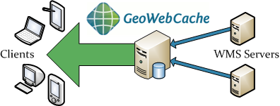
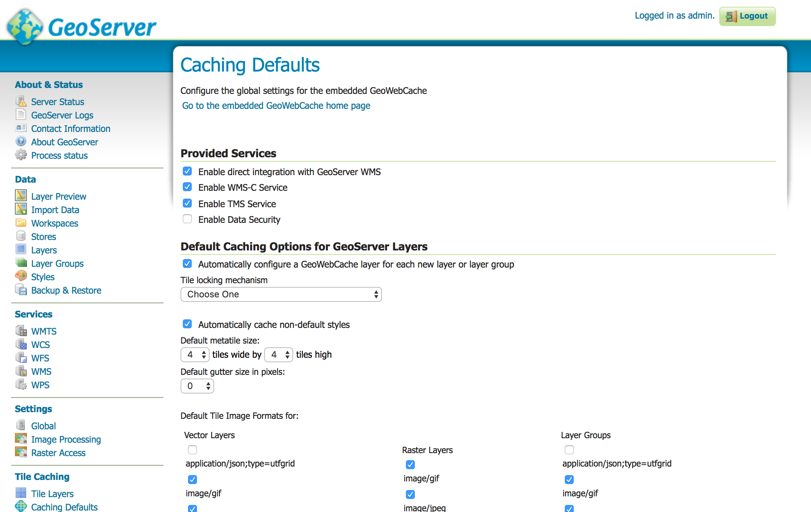
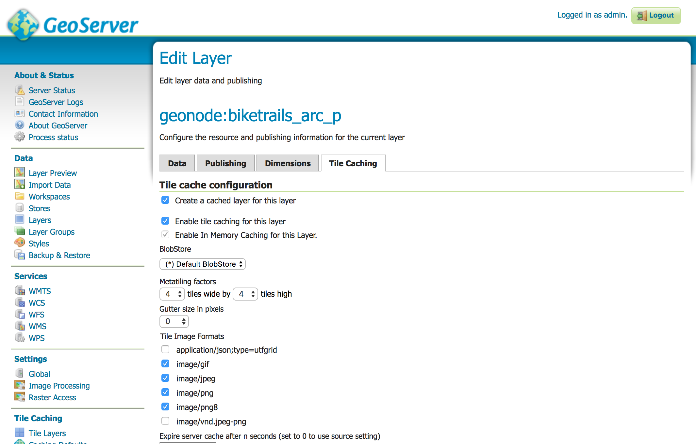
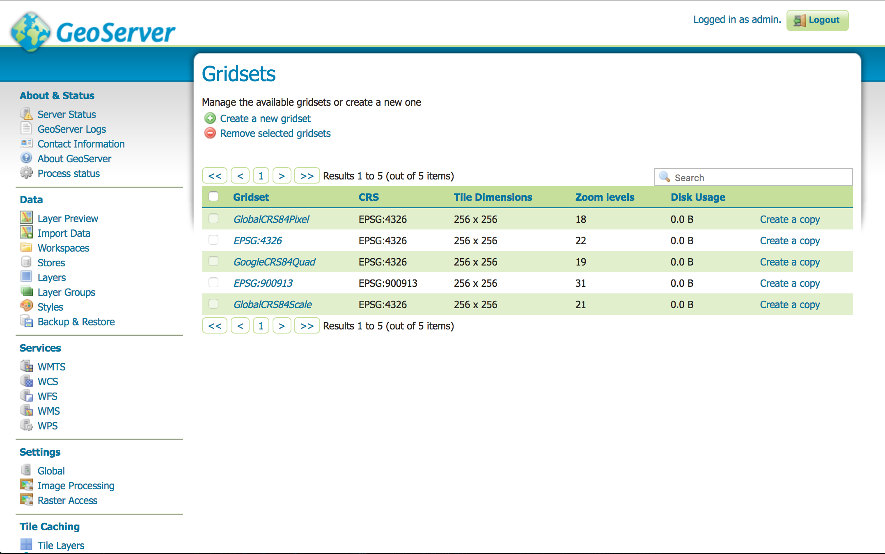
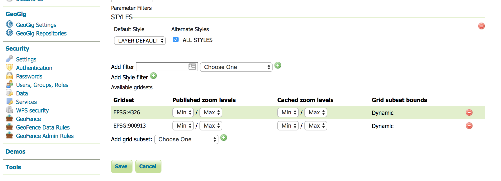
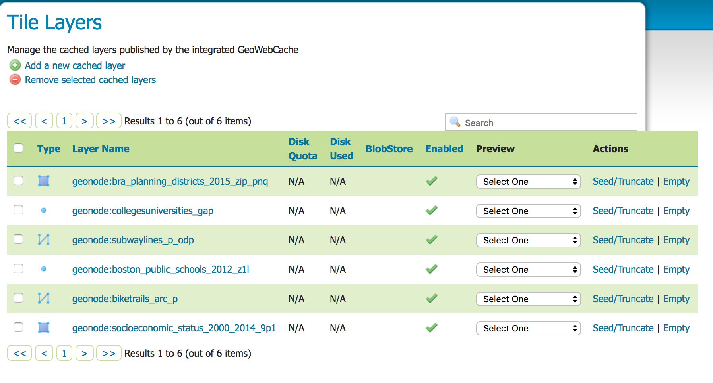
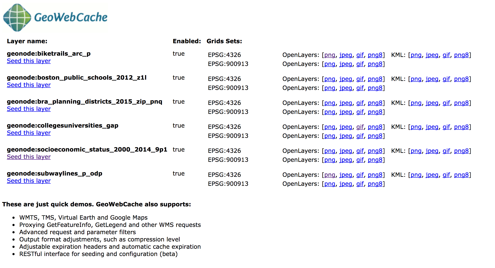
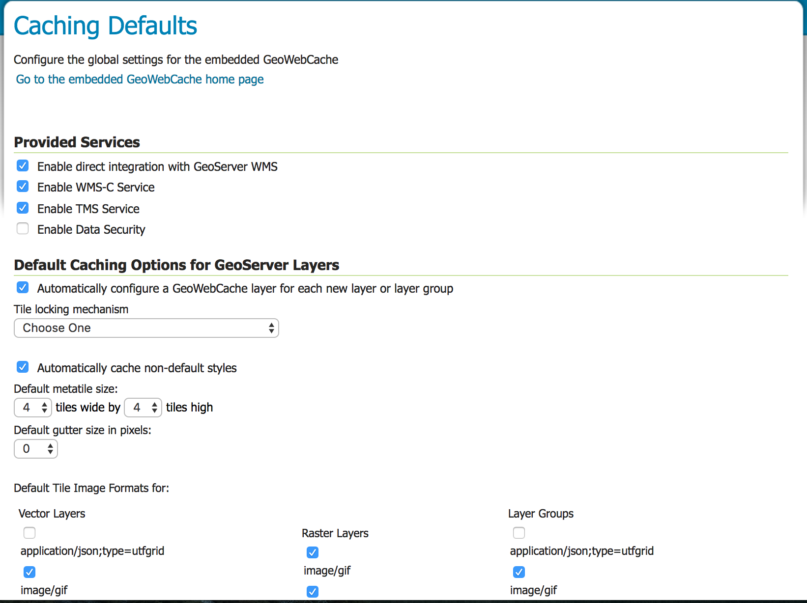
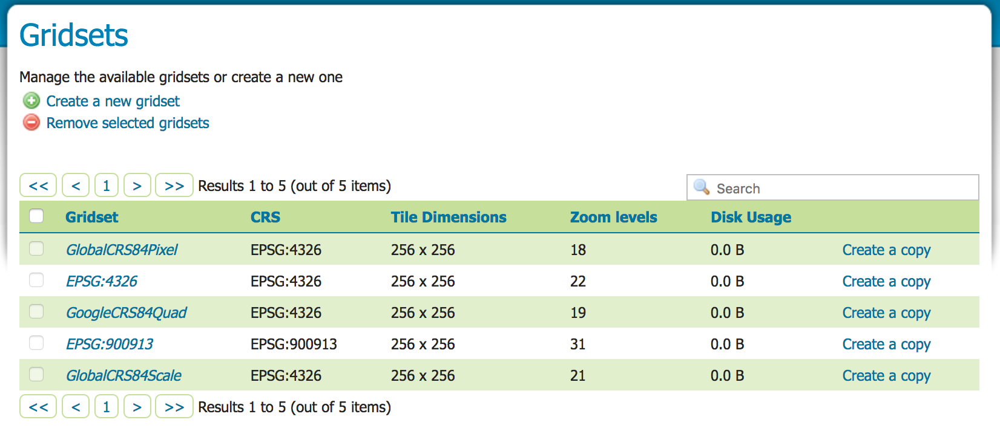
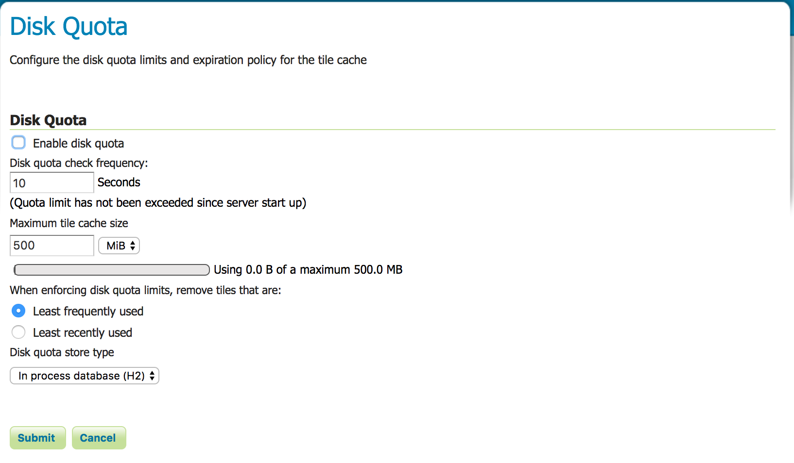

# Tiles caching with GeoWebCache

WSM GetMap requests may be time and resource consuming. As many times underlying data are not changing and tiles generated by WMS are always the same, it makes sense to cache them. That is where GeoWebCache comes handy.

> GeoWebCache is a Java web application used to cache map tiles coming from a variety of sources such as OGC Web Map Server (WMS). It implements various service interfaces (such as WMS-C, WMTS, TMS, Google Maps KML, Virtual Earth) in order to accelerate and optimize map image delivery. It can also recombine tiles to work with regular WMS clients.

> Maps are often static. As most mapping clients render WMS (Web Map Service) data every time they are queried, this can result in unnecessary processing and increased wait times. GeoWebCache optimizes this experience by saving (caching) map images, or tiles, as they are requested, in effect acting as a proxy between client (such as OpenLayers or Google Maps) and server (such as GeoServer, or any WMS-compliant server). As new maps and tiles are requested, GeoWebCache intercepts these calls and returns pre-rendered tiles if stored, or calls the server to render new tiles as necessary. Thus, once tiles are stored, the speed of map rendering increases by many times, creating a much improved user experience.



For more information on GeoWebCache (GWC) you can have a look at the [official documentation](http://geowebcache.org/docs/current/) or at the [Using GeoWebCache from GeoServer official documentation](http://docs.geoserver.org/latest/en/user/geowebcache/using.html)

GWC is very well integrated in GeoServer (and thus in GeoNode). On GeoNode, by default, WMS requests are cascaded to the GWC endpoint. This behavior can be altered using the *Caching Defaults* session of the GeoServer administrative site.



As you can see, by default the direct integration of GWC with GeoServer WMS is enabled, and each layer which is uploaded to GeoNode is automatically configured for being cached in GWC.

If you look at the GeoServer layer page for one of the layers, you will see that in the *Tile Caching* section the options for creating a cached layer and for enabling tile caching for that layer are enabled by default.



GeoServer WMS will cache and retrieve tiles from GeoWebCache using a GetMap request only if all of these criteria are followed:

* WMS Direct integration is enabled (which is the case for standard GeoNode, as previously described)
* caching is enabled for that layer (which is the case for standard GeoNode, as previously described)
* request only references a single layer
* tiled=true is included in the request
* image requested is of the same height and width as the size saved in the layer configuration
* requested CRS matches one of the available tile layer gridsets
* image requested lines up with the existing grid bounds
* a parameter is included for which there is a corresponding Parameter Filter

All of these criteria are respected by GeoNode: for example look at this WMS request which is run from the mapping client in the layer page for the "Socioeconomic Status (2000 - 2014) layer (http://localhost:8000/layers/geonode:socioeconomic_status_2000_2014_9p1):

http://localhost:8080/geoserver/wms?LAYERS=geonode%3Asocioeconomic_status_2000_2014_9p1&TRANSPARENT=TRUE&SERVICE=WMS&VERSION=1.1.1&REQUEST=GetMap&STYLES=&FORMAT=image%2Fpng&TILED=true&SRS=EPSG%3A900913&BBOX=-7912761.16698,5209947.8471924,-7910315.1820752,5212393.8320972&WIDTH=256&HEIGHT=256

Let's analyze if the criteria are respected (the first two ones are already):

* the request reference just a layer: *geonode:socioeconomic_status_2000_2014_9p1*
* TILED=true is in the request
* width (256) and height (256) correspond to available gridsets, as it can be checked in the GeoServer administrative site: *Tile Caching* > *Gridsets*



* requested CRS (EPSG:900913) is one of the available tile layer gridsets, as it can be checked in the GeoServer administrative site: *Layers* > *Layer Name* > *Tile Caching*



* image requested lines up with the existing grid bounds, as it is OpenLayers which is taking care of this
* there are not [parameter filters](http://docs.geoserver.org/latest/en/user/geowebcache/using.html#supported-parameter-filters) in the request

## GeoWebCache GeoServer interface

GWC is integated directly in GeoServer and in the GeoServer administrative site. Now you will have a quick tour of the GeoServer interface pages that interacts with GWC. All of these pages are linked in the *Tile Caching* section of the left menu of the interface:

### Tile Layers

The *Tile Layers* page shows a list of the layers which are integrated in GWC, and some of their properties:

* *Disk quota* provides the maximum amount of disk space which can be used for a given layer. It will be N/A by default, until *Disk Quotas* are enabled
* *Disk used* is the disk space being used by the tiles generated for a given layer
* *Enabled* indicates if a given layer has tile caching enabled
* *Preview* provides, similarly to the *Layer Preview* for WMS, a simple OpenLayers application to browse the tiles of a layer for each given gridsets (combination of spatial reference and output format)  
* *Seed/Truncate* opens the GWC for automatically seeding and truncating the tile cache. This is useful if you need to pre-populate the cache for a layer
* *Empty* removes all of the cached tiles for a given layer



From the *Tile Layers* page it is also possible to add (or remove) layers to the cache.

### GWC Demo Page

GWC provides also a demo page which is accessible at this url: http://localhost:8080/geoserver/gwc/demo



### Caching Defaults

By using the *Caching Defaults* pageit is possible:

* enable direct integration with GeoServer WMS. As you have read before, by default it is enabled in GeoNode
* enable GWC Cached Web Map Service (WMS-C) endpoint: http://localhost:8080/geoserver/gwc/service/wms?
* enable GWC Tiled Map Service (TMS) endpoint: http://localhost:8080/geoserver/gwc/service/tms/1.0.0?
* enable GWC Web Map Tiled Service (WMTS) endpoint: http://localhost:8080/geoserver/gwc/service/wmts?
* set default and global options for the tile cache in GeoServer: from here it is possible to automatically configure a GWC layer for each new layer and automatically cache non-default styles (both this option are enabled by default in GeoNode)
* set default image formats that can be cached - which can be different for vector, raster and layer groups
* set the gridsets that will be automatically configured for cached layers. By default only two ones are enabled, which correspon to the most common and universal cases:
  * EPSG:4326 (geographic) with 22 maximum zoom levels and 256x256 pixel tiles
  * EPSG:900913 (spherical Mercator) with 31 maximum zoom levels and 256x256 pixel tiles

You can access WMS-C (used by GeoNode), TMS and WMTS GetCapabilities documents from the GeoServer administrative home page.



### Gridsets

A gridset defines a spatial reference, bounding box, a list of zoom levels and tile dimensions. It is possible to handle gridset from the *Gridsets* page. By default there are five preconfiguret gridsets. From this section it is possible to edit, remove or create new gridsets.




### Disk Quotas

The *Disk Quotas* page can be used to manage the disk usage for cached tiles - which could easily grow intensively - and allows to set the global disk space which GWC can use for its cache. By enabling it (by default it is not in GeoNode) you can specify the maximum tile cache size (by default 500 MB) and the tile removal policy (by default "Least frequently used" tiles).



## GeoWebCache directory

GeoNode stores the GeoServer GWC cache in the *gwc* directory on the root of the GeoServer data directory, which is in */workshop/geonode/geoserver/data*. Both the location of the GeoServer data directory and the location of the GWC cache directory can be changed in GeoNode from the GeoServer main *web.xml* configuration file (which is, for the case of this workshop, in */workshop/geonode/geoserver/geoserver/WEB-INF/web.xml*).

Take some minutes to inspect the GWC cache directory:

```sh
$ cd /workshop/geonode/geoserver/data/gwc
$ ls
geonode_biketrails_arc_p                     geonode_subwaylines_p_odp
geonode_boston_public_schools_2012_z1l       geowebcache.xml
geonode_bra_planning_districts_2015_zip_pnq  _gwc_in_progress_deletes_
geonode_collegesuniversities_gap             tmp
geonode_socioeconomic_status_2000_2014_9p1
```

You can recognize one directory for each cached layer. It you inspect one of the cached layer directory you should recognize a structure like this (you may need to install the *tree* Linux command running 'sudo apt install tree' to see this output in your shell):

```sh
$ tree geonode_biketrails_arc_p
├── EPSG_900913_02
│   └── 0_0
│       └── 01_02.png
├── EPSG_900913_06
│   └── 01_02
│       ├── 0018_0040.png
│       └── 0019_0040.png
├── EPSG_900913_07
│   └── 02_05
│       ├── 0037_0080.png
│       ├── 0038_0080.png
│       └── 0039_0080.png
├── EPSG_900913_08
│   └── 02_05
│       ├── 0075_0160.png
│       ├── 0075_0161.png
│       ├── 0076_0160.png
│       ├── 0076_0161.png
│       ├── 0077_0160.png
│       ├── 0077_0161.png
│       ├── 0078_0160.png
│       └── 0078_0161.png
├── EPSG_900913_09
│   └── 04_10
│       ├── 0151_0320.png
│       ├── 0151_0321.png
```

For each supported spatial reference system (EPSG:900913 and EPSG:4326 when using GeoNode), zoom level and style GWC create a different directory where the tiles are stored.

Try to add another style to the layer to see the difference.

## Requests to the GWC endpoints

### WMS-C

The WMS Tiling Client Recommendation, or WMS-C for short, is a recommendation set by OSGeo for making tiled requests using WMS.

If a layer is configured to be cached, as it happens by default in GeoNode, the mapping client is sending GetMap request to the WMS-C endpoint using the same GetMap parameters of a GetMap request to the WMS. The only thing to change is the TILED=true parameter appended to the request:

http://localhost:8080/geoserver/wms?LAYERS=geonode%3Asocioeconomic_status_2000_2014_9p1&TRANSPARENT=TRUE&SERVICE=WMS&VERSION=1.1.1&REQUEST=GetMap&STYLES=&FORMAT=image%2Fpng&TILED=true&SRS=EPSG%3A900913&BBOX=-7912761.16698,5209947.8471924,-7910315.1820752,5212393.8320972&WIDTH=256&HEIGHT=256


### TMS

For an explanation of Tile Map Service Specification (TMS) check [here](http://wiki.osgeo.org/wiki/Tile_Map_Service_Specification).

z is the zoom level, while x and y define a given tile for a given zoom level.

Request to the TMS endpoints can be run in this format:

http://localhost:8080/geoserver/gwc/service/tms/1.0.0/layername/z/x/y.formatExtension

For example:

http://localhost:8080/geoserver/gwc/service/tms/1.0.0/geonode:biketrails_arc_p/10/610/750.png

In order to support multiple formats and spatial reference systems, the general path is:

http://localhost:8080/geoserver/gwc/tms/1.0.0/layername@grisetId@formatExtension/z/x/y.format

### WMTS

WMTS is the [OGC Web Map Tile Service Standard](http://www.opengeospatial.org/standards/wmts).

Here is how to make a GetTile request to the WMTS endpoint in GeoServer:

http://localhost:8080/geoserver/gwc/service/wmts?SERVICE=WMTS&REQUEST=GetTile&VERSION=1.0.0&LAYER=geonode:biketrails_arc_p&STYLE=_null&TILEMATRIXSET=EPSG%253A900913&TILEMATRIX=EPSG%253A900913%253A3&TILEROW=2&TILECOL=2&FORMAT=image%252Fpng

While OWSLib does not support WMS-C and TMS, you can use OWSLib to interact with WMTS:

```python
>>> from owslib.wmts import WebMapTileService
>>> wmts = WebMapTileService('http://localhost:8080/geoserver/gwc/service/wmts?')
>>> print wmts.identification.title
Web Map Tile Service - GeoWebCache
>>> print wmts.identification.abstract

>>> for operation in wmts.operations:
        print operation.name     
GetCapabilities
GetTile
GetFeatureInfo

>>> list(wmts.contents)
['geonode:boston_public_schools_2012_z1l',
 'geonode:biketrails_arc_p',
 'geonode:socioeconomic_status_2000_2014_9p1',
 'geonode:subwaylines_p_odp']

>>> layer = wmts['geonode:biketrails_arc_p']
>>> print layer.title
Bike Trails updated
>>> print layer.name
geonode:biketrails_arc_p
>>> print layer.abstract
2009 MBTA bike trails updated
```

## GeoWebCache REST API

As GeoServer, GeoWebCache provides a [REST API](http://docs.geoserver.org/latest/en/user/geowebcache/rest/index.html) for working programmatically with the GeoWebCache configuration.

The GWC REST API endpoint is at: http://localhost:8080/geoserver/gwc/rest

By using the GWC REST API it is possible to:

* Add, modify or delete layers from GWC
* Seeding and truncating the layer's cache
* Changing the Disk Quotas configuration

One common use case it is to use the REST API to refresh the cache for a layer when it is edited from clients which are not using WFS-T (when using WFS-T the cache for the layer it is automatically udpated)
