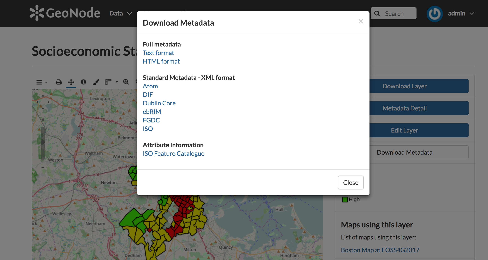
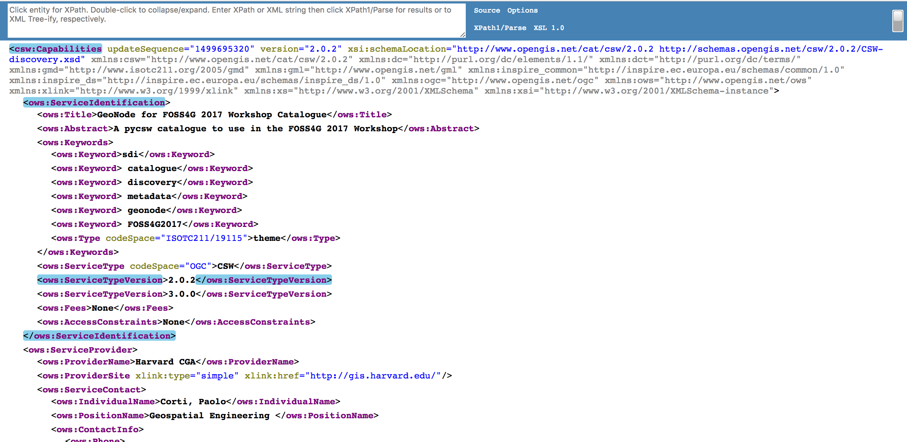

# Catalogue services with pycsw

In GeoNode [OGC Catalogue Service for the Web, CSW](http://www.opengeospatial.org/standards/cat) services are provided by [pycsw](http://pycsw.org/).

> pycsw is an OGC CSW server implementation written in Python. Started in 2010 (more formally announced in 2011), pycsw allows for the publishing and discovery of geospatial metadata via numerous APIs (CSW 2/CSW 3, OpenSearch, OAI-PMH, SRU), providing a standards-based metadata and catalogue component of spatial data infrastructures. pycsw is Open Source, released under an MIT license, and runs on all major platforms (Windows, Linux, Mac OS X).

CSW is a standard for exposing a catalogue of geospatial entities on HTTP. In a GeoNode SDI or portal CSW endpoints are provided by pycsw, which is an underlying component of the GeoNode's stack. Alternatively, if needed, it is possible to replace pycsw with [GeoNetwork](http://geonetwork-opensource.org/).

## Using pycsw in GeoNode

In GeoNode you can easily access to the CSW record for one layer by clicking in the *Download Metadata* button in the layer page. A form will pop up and you will be able to access to metadata provided by pycsw in a series of formats (Atom, Dublin, FGDC, Text, HTML and many others)



For example, clicking on the *ISO* link you will access to the metadata for the layer in the ISO format, which corresponds to this *GetRecordById* request in pycsw:

http://localhost:8000/catalogue/csw?outputschema=http%3A%2F%2Fwww.isotc211.org%2F2005%2Fgmd&service=CSW&request=GetRecordById&version=2.0.2&elementsetname=full&id=8bcf5bfc-5cfc-11e7-8103-02d8e4477a33

Look at the pycsw output of this request, and you should recognize to the information which you filled in an earlier tutorial:

* title
* keywords
* place keywords
* category

You can also notice other information which was generated by GeoNode behind the scenes when the layer has been uploaded:

* identifier of the layer, which uniquely identifies the layer in the catalogue (note that the GetRecordById request uses this identifier to access the record)
* creation dateStamp
* spatial reference system and bounding box
* thumbnail url
* format of the resource
* several OGC endpoints

If you want to add missing metadata you can visit the layer metadata page of the layer and press on *Edit Layer* > *Edit Metadata*

## pycsw operations

pycsw implements all of the CSW standard operations, including the optional ones:

* *GetCapabilities* retrieves service metadata from the server
* *DescribeRecord*  allows a client to discover elements of the information model supported by the target catalog service
* *GetRecords* search for records using a series of criteria
* *GetRecordById* retrieves metadata for one record (layer) of the catalogue by its id
* *GetDomain* (optional) retrieves runtime information about the range of values of a metadata record element or request parameter
* *Harvest* (optional) create/update metadata by asking the server to 'pull' metadata from somewhere
* *Transaction* (optional) create/edit metadata by 'pushing' the metadata to the server

In the following you will have a look at some of this operations.

### GetCapabilities

*GetCapabilities* retrieves service metadata from the server. You can try the GetCapabilities operation by going to this url: http://localhost:8000/catalogue/csw?service=CSW&version=2.0.2&request=GetCapabilities

You should recognize in the pycsw GetCapabilities output the following sections:

* Service identification (title, abstract keywords...)
* Service provider (several contact information)
* Operations metadata (one for each supported operation)
* Filter capabilities

You can change the metadata of the pycsw server (service identification and provider sections) of your GeoNode instance by editing the */workshop/geonode/geonode/local_settings.py* file. Open that file (or create it if you still have not), and add the following information, changing the settings to your needs:

```python
# pycsw settings
PYCSW = {
    # pycsw configuration
    'CONFIGURATION': {
        # uncomment / adjust to override server config system defaults
        # 'server': {
        #    'maxrecords': '10',
        #    'pretty_print': 'true',
        #    'federatedcatalogues': 'http://catalog.data.gov/csw'
        # },
        'metadata:main': {
            'identification_title': 'GeoNode for FOSS4G 2017 Workshop Catalogue',
            'identification_abstract': 'A pycsw catalogue to use in the FOSS4G 2017 Workshop',
            'identification_keywords': 'sdi, catalogue, discovery, metadata, geonode, FOSS4G2017',
            'identification_keywords_type': 'theme',
            'identification_fees': 'None',
            'identification_accessconstraints': 'None',
            'provider_name': 'Harvard CGA',
            'provider_url': 'http://gis.harvard.edu/',
            'contact_name': 'Corti, Paolo',
            'contact_position': 'Geospatial Engineering ',
            'contact_address': '1737 Cambridge Street, K350',
            'contact_city': 'Cambridge',
            'contact_stateorprovince': 'Massachusetts',
            'contact_postalcode': '02138',
            'contact_country': 'US',
            'contact_phone': '+1-617-496-0103',
            'contact_fax': '+1-617-496-5149',
            'contact_email': 'pcorti@...',
            'contact_url': 'Contact URL',
            'contact_hours': 'Hours of Service',
            'contact_instructions': 'During hours of service. Off on ' \
            'weekends.',
            'contact_role': 'pointOfContact',
        },
        'metadata:inspire': {
            'enabled': 'true',
            'languages_supported': 'eng,gre',
            'default_language': 'eng',
            'date': 'YYYY-MM-DD',
            'gemet_keywords': 'Utility and governmental services',
            'conformity_service': 'notEvaluated',
            'contact_name': 'Organization Name',
            'contact_email': 'Email Address',
            'temp_extent': 'YYYY-MM-DD/YYYY-MM-DD',
        }
    }
}
```

Now check if the GetCapabilities response is correctly updated by pycsw



### DescribeRecord

*DescribeRecord*  allows a client to discover elements of the information model supported by the target catalog service. You can try this request by going to this url:

http://localhost:8000/catalogue/csw?service=CSW&version=2.0.2&request=DescribeRecord&TypeName=csw:Record

### GetRecords

*GetRecords* search for records using a series of filters. This is returning all of the pycsw records:

http://localhost:8000/catalogue/csw?service=CSW&version=2.0.2&request=GetRecords&ElementSetName=full&typenames=csw:Record&resulttype=results

It is possible to retrieve records using several types of text and spatial filters. For example here is a request to filter records which have the word "bike" in metadata text and fall within a bounding box of (-180, -90, 180, 90):

http://localhost:8000/catalogue/csw?service=CSW&version=2.0.2&request=GetRecords&ElementSetName=full&typenames=csw:Record&resulttype=results&q=bike&bbox=-180,-90,180,90

A great source to get a good understanding of the filters is to read at the [pycsw test suite](https://github.com/geopython/pycsw/tree/master/tests)

### GetRecordById

*GetRecordById* retrieves metadata for one record (layer) of the catalogue by its id. You have seen this request previously, when requesting the metadata record from the GeoNode user interface:

http://localhost:8000/catalogue/csw?outputschema=http%3A%2F%2Fwww.isotc211.org%2F2005%2Fgmd&service=CSW&request=GetRecordById&version=2.0.2&elementsetname=full&id=8bcf5bfc-5cfc-11e7-8103-02d8e4477a33

## Accessing the pycsw catalogue from Python

Now you will access and query the GeoNode pycsw catalogue using OWSLib (as you did with OCG services exposed by GeoServer and GeoWebCache in previous tutorials).

Go to your Django shell for this purpose. If your Django shell is not open, open a new shell, log in the vagrant box, activate the virtualenv and run again the Django shell:

```sh
✗ vagrant ssh
$ . /workshop/env/bin/activate
$ cd /workshop/geonode/
$ python manage.py shell
```

As a first thing you will connect to the pycsw CSW endpoint and query the service identification and provider:

```python
>>> from owslib.csw import CatalogueServiceWeb
>>> csw = CatalogueServiceWeb('http://localhost:8000/catalogue/csw')
>>> print csw.identification.title
GeoNode for FOSS4G 2017 Workshop Catalogue
>>> print csw.identification.abstract
A pycsw catalogue to use in the FOSS4G 2017 Workshop
>>> print csw.identification.keywords
['sdi', ' catalogue', ' discovery', ' metadata', ' geonode', ' FOSS4G2017']
>>> print csw.provider.contact
<owslib.ows.ServiceContact object at 0x7f296e99a850>
>>> print csw.provider.name
Harvard CGA
>>> print csw.provider.url
http://gis.harvard.edu/
>>> print csw.provider.contact.name
Corti, Paolo
>>> print csw.provider.contact.city
Cambridge
```

Now print the supported CSW operations:

```python
for operation in csw.operations:
    print operation.name    
GetCapabilities
DescribeRecord
GetDomain
GetRecords
GetRecordById
GetRepositoryItem
```
Get all metadata records which contains the text 'boston':

```python
>>> from owslib.fes import PropertyIsEqualTo
>>> boston_query = PropertyIsEqualTo('csw:AnyText', 'boston')
>>> csw.getrecords2(constraints=[boston_query])

>>> print csw.results
{'matches': 5, 'nextrecord': 0, 'returned': 5}

>>> for record in csw.records:
        print csw.records[record].title  
Boston Public Schools (2012)
Socioeconomic Status (2000 - 2014)
"MBTA Subway Lines
Colleges and Universities in Boston
Boston Planning Districts (BRA)
```

Get all metadata in the US extent:

```python
>>> from owslib.fes import BBox
>>> us_bbox = BBox([-125,24,-66,49])
>>> csw.getrecords2(constraints=[boston_query, us_bbox])
>>> csw.getrecords2(constraints=[us_bbox])
>>> print csw.results
{'matches': 1, 'nextrecord': 0, 'returned': 1}
```

Get a record by the id:

```python
>>> csw.getrecordbyid(id=['8bcf5bfc-5cfc-11e7-8103-02d8e4477a33'])
>>> csw.records
OrderedDict([('8bcf5bfc-5cfc-11e7-8103-02d8e4477a33',
              <owslib.csw.CswRecord at 0x7f296e97d990>)])
>>> record = csw.records['8bcf5bfc-5cfc-11e7-8103-02d8e4477a33']
>>> print record.title
Socioeconomic Status (2000 - 2014)
>>> print record.abstract
Socio-economic Status Index Range
```

## Accessing the pycsw catalogue from QGIS

TODO
