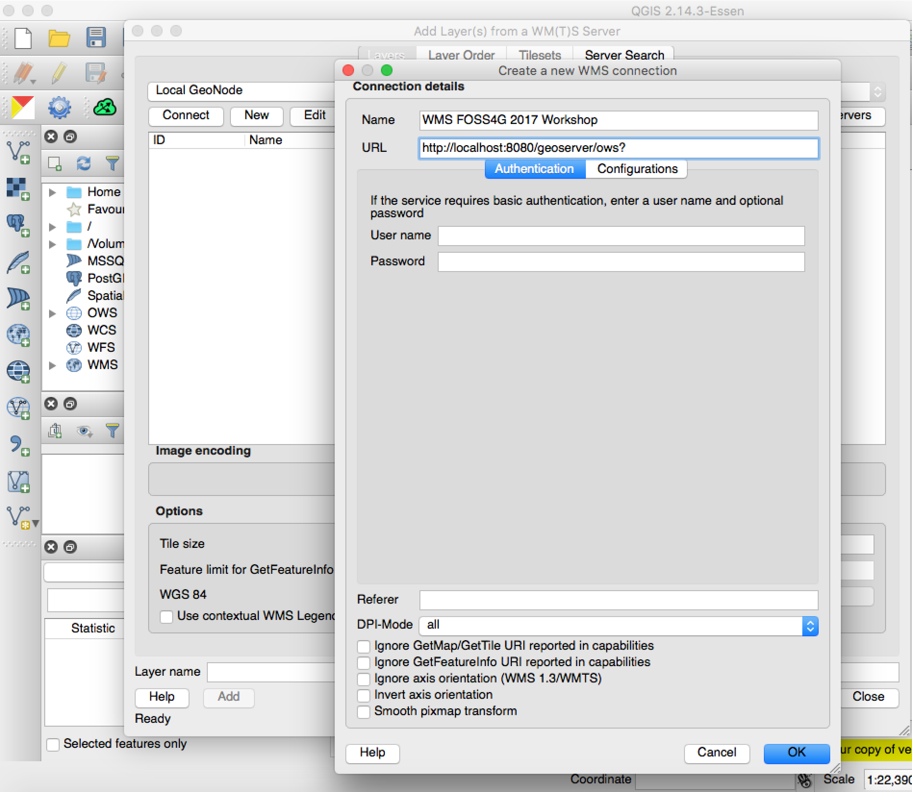
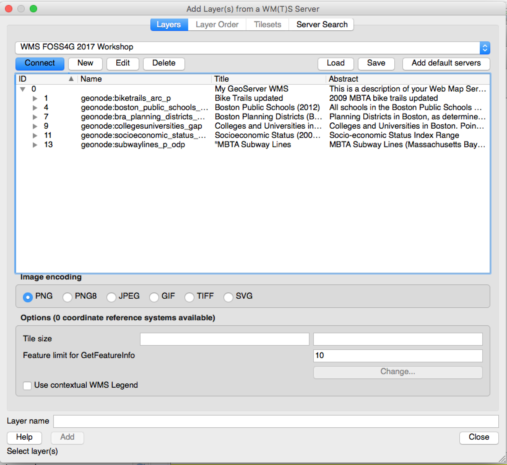
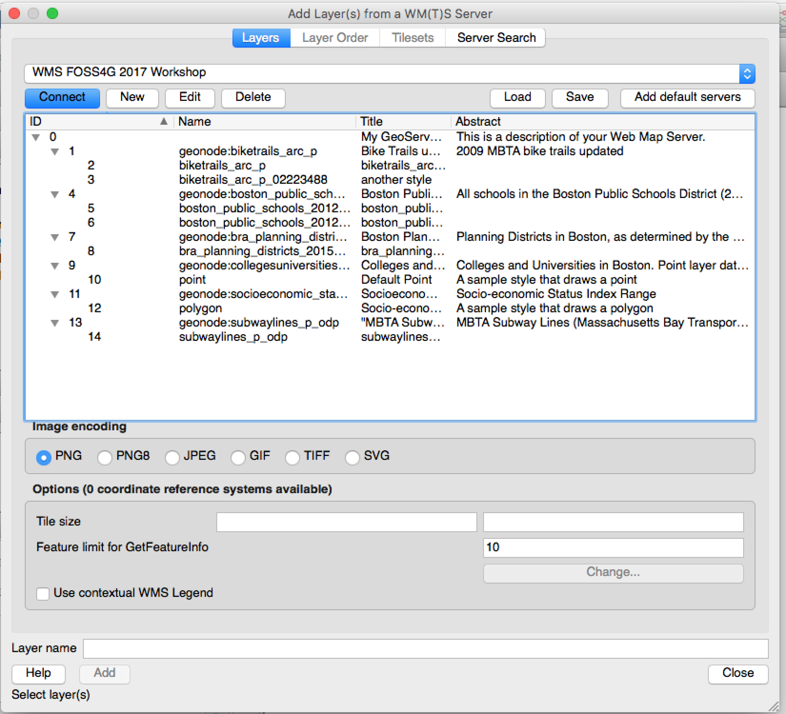
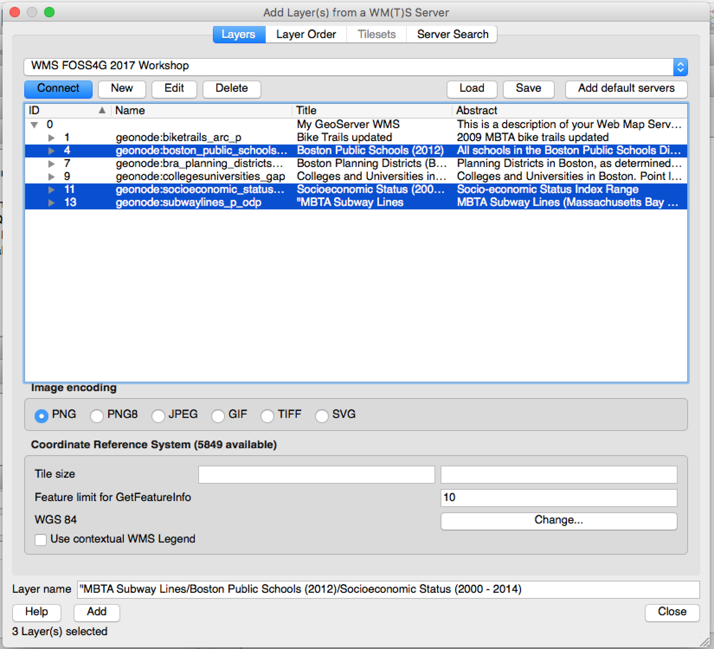
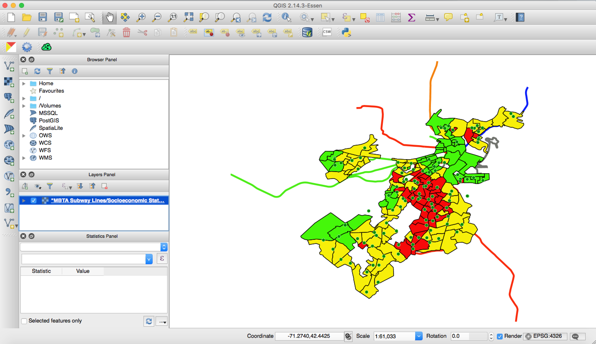
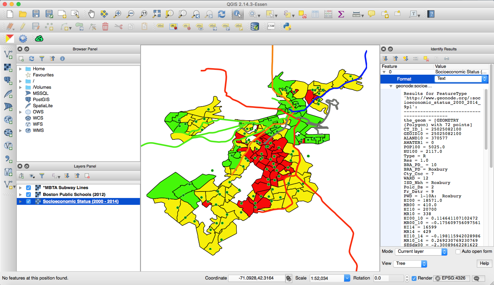
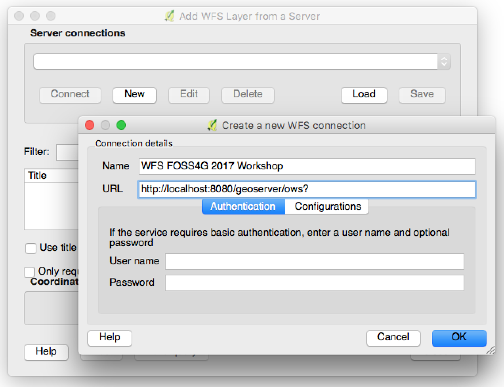
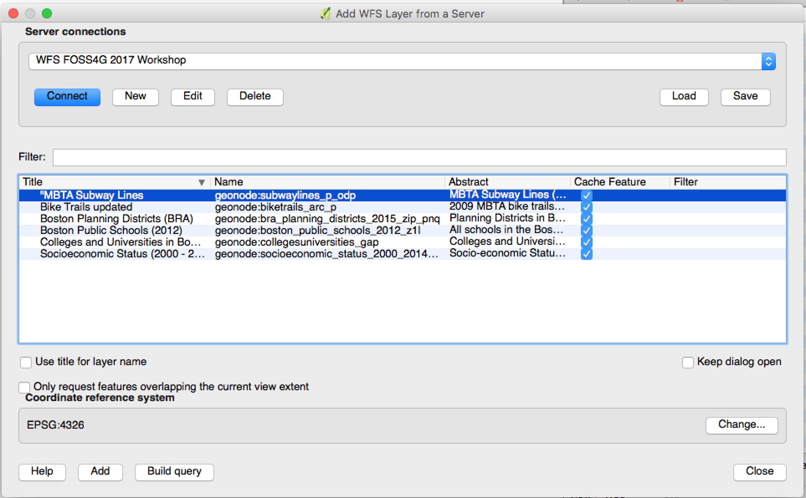
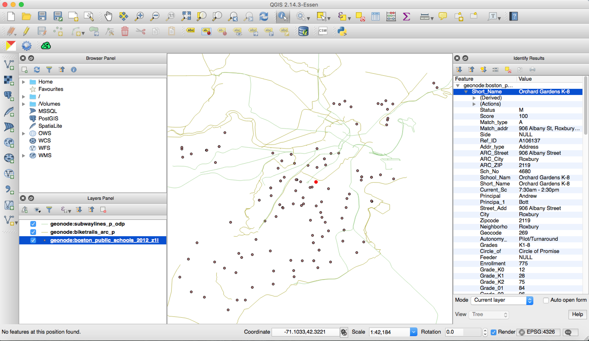
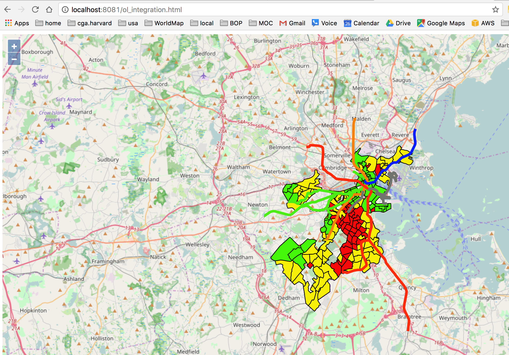

# Using GeoNode OGC services with external clients

In this tutorial you will see the GeoNode WMS and WFS OGC services in action with some different clients: QGIS (a desktop client), OpenLayers (a javascript client) and GDAL/OGR (a command line client).

Bonus step: try this kind of integration with other client such as gvSIG, OpenJUMP GIS, Esri ArcGIS, Leaflet etc...

## QGIS

> QGIS (previously known as Quantum GIS) is a cross-platform free and open-source desktop geographic information system (GIS) application that supports viewing, editing, and analysis of geospatial data.

You used [QGIS](http://www.qgis.org/en/site/) previously to connect to pycsw, the GeoNode's CSW catalogue. Here you will use QGIS to access the WMS and WFS GeoNode services.

### WMS

As a first thing, open the WMS connection dialog by clicking on the *Layer* menu, then *Add Layer* > *Add WMS/WMTS Layer*
. From there, create a new WMS connection with these parameters:

* Name: WMS FOSS4G 2017 Workshop
* url: http://localhost:8080/geoserver/ows?



Now click on the *Connect* button, the list of layers should appear



Note how each layer can be used in QGIS with each one of its styles



Select one or more layers and click on the *Add* button



Layers are added in the map as a layers group



Remove the layers group from the map and add each single layer to the map. Then browse the map and try to identify some of the features of each layer



### WFS

Open the WFS connection dialog by clicking on the *Layer* menu, then *Add Layer* > *Add WFS Layer*

Create new WFS connection using these parameters:

* Name: WFS FOSS4G 2017 Workshop
* url: http://localhost:8080/geoserver/ows?



Now click on the *Connect* button, the list of layers should appear



Select one or more layers and click on the *Add* button. Layers are added in the map. Then browse the map and try to identify some of the features of each layer



Layers have been added in QGIS as vector layers. Therefore it is possible to use most of the QGIS tools which are for vectors, for example try to:

* open the attribute table of a layer
* change the style of a layer
* query a layer to select some of its features
* export a layer to shapefile
* project a layer to a different spatial reference system
* edit a layer: this will use WFS-T behind the scenes and will work only if you use the credentials of a GeoServer user in the connect dialog. For example you can try with the *admin* GeoServer user (default password is "geoserver")

## OpenLayers

> OpenLayers is an open source (provided under the 2-clause BSD License) JavaScript library for displaying map data in web browsers as slippy maps. It provides an API for building rich web-based geographic applications similar to Google Maps and Bing Maps.

[OpenLayers](http://openlayers.org/) is used by GeoNode itself, together with [GeoExt](http://www.geoext.org/), both in the layer details page and in the default map composer.

You can use OpenLayers to create custom viewers for your online mapping needs. Here you will see how to add some of the GeoNode layers to an OpenLayers map using the WMS endpoint.

For this purpose, you need an HTTP server to display an OpenLayers map in a html page. Install [nginx](https://nginx.org/en/) (alternatively you could install [httpd](https://httpd.apache.org/)):

```sh
sudo apt-get install nginx
```

Check if nginx is running at: http://localhost:8081/ (we forwarded the guest 80 port to the host 8081 port in Vagrantfile).

Now create this html file at: /var/www/html/ol3_integration.html

```html
<!DOCTYPE html>
<html>
  <head>
    <title>OL WMS Integration</title>
    <link rel="stylesheet" href="https://openlayers.org/en/v4.2.0/css/ol.css" type="text/css">
    <!-- The line below is only needed for old environments like Internet Explorer and Android 4.x -->
    <script src="https://cdn.polyfill.io/v2/polyfill.min.js?features=requestAnimationFrame,Element.prototype.classList,URL"></script>
    <script src="https://openlayers.org/en/v4.2.0/build/ol.js"></script>
  </head>
  <body>
    <div id="map" class="map"></div>
    <script>
      var layers = [
        new ol.layer.Tile({
          source: new ol.source.OSM()
        }),
        new ol.layer.Tile({
          extent: [-7926000, 5190846, -7895123, 5225000],
          source: new ol.source.TileWMS({
            url: 'http://localhost:8080/geoserver/wms',
            params: {
                      'LAYERS': 'geonode:socioeconomic_status_2000_2014_9p1,geonode:subwaylines_p_odp',
                      'TILED': true
                    },
            serverType: 'geoserver'
          })
        })
      ];
      var map = new ol.Map({
        layers: layers,
        target: 'map',
        view: new ol.View({
          center: [-7910000, 5210000],
          zoom: 11
        })
      });
    </script>
  </body>
</html>
```

Browse to http://localhost:8081/ol_integration.html and you should see an interactive OpenLayers map with two of the GeoNode layers (*socioeconomic_status_2000_2014_9p1* and *subwaylines_p_odp*)



### GDAL/OGR

OGR, the vector part library of [GDAL](http://www.gdal.org/), can connect to WFS and WMS OGC services with the [WFS driver](http://www.gdal.org/drv_wfs.html) and the [WMS driver](http://www.gdal.org/frmt_wms.html). Here you will have a look at the former one.

As for any geospatial format, GDAL/OGR can access WFS data programmatically (using several languages including Python) or using powerful command line tools. Here you will use the [ogrinfo](http://www.gdal.org/ogrinfo.html) and [ogr2ogr](http://www.gdal.org/ogr2ogr.html) command line tools.

As a first thing, try to get the list of layers in GeoNode with ogrinfo:

```sh
$ ogrinfo -ro WFS:http://localhost:8080/geoserver/ows
INFO: Open of `WFS:http://localhost:8080/geoserver/ows'
      using driver `WFS' successful.
1: geonode:biketrails_arc_p (Multi Line String)
2: geonode:bra_planning_districts_2015_zip_pnq (Multi Polygon)
3: geonode:boston_public_schools_2012_z1l (Point)
4: geonode:collegesuniversities_gap (Point)
5: geonode:subwaylines_p_odp (Multi Line String)
6: geonode:socioeconomic_status_2000_2014_9p1 (Multi Polygon)
```

Now list the features of the *boston_public_schools_2012_z1l*, with a given filter (in this case a given zip code):

```sh
$ ogrinfo -ro WFS:http://localhost:8080/geoserver/ows geonode:boston_public_schools_2012_z1l -where "Zipcode=2126"
INFO: Open of `WFS:http://localhost:8080/geoserver/ows'
      using driver `WFS' successful.
Layer name: geonode:boston_public_schools_2012_z1l
Geometry: Point
Feature Count: 6
Extent: (232573.480140, 890829.010078) - (234844.560065, 892465.220076)
...
```

Finally, using ogr2ogr, here is how you can export the features of the OGC WFS layer to a shapefile:

```sh
$ ogr2ogr /workshop/test.shp WFS:http://localhost:8080/geoserver/ows geonode:boston_public_schools_2012_z1l -where "Zipcode=2126"
```

Check if the shapefile was correctly generated at */workshop/test.shp*
