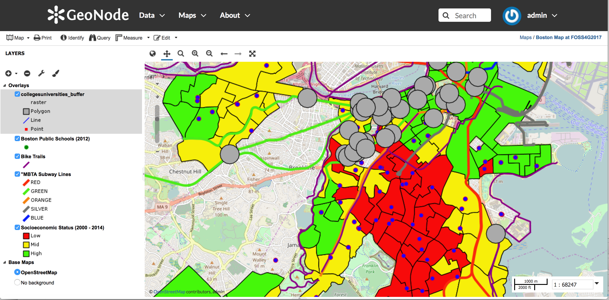

# Using GeoNode management commands

GeoNode comes with some useful [management commands](http://docs.geonode.org/en/master/tutorials/admin/admin_mgmt_commands/) that can be run by the GeoNode administrators:

* *importlayers* Imports a file or folder with geospatial files to GeoNode
* *updatelayers* Update the GeoNode application with data from GeoServer
* *fixsitename* Uses SITENAME and SITEURL to set the values of the default site object
* *delete_orphaned_files* Deletes orphaned files of deleted documents
* *delete_orphaned_thubms* Deletes orphaned thumbnails of deleted GeoNode resources (Layers, Maps and Documents)
* *fix_baselayers* Fix base layers for all of the GeoNode maps or for a given map

In this tutorial you will become familiar with *updatelayers* and *importlayers*

## updatelayers

*updatelayers* update the GeoNode layers with data from GeoServer. This is useful to add data in formats that are not supported in GeoNode by default, like ArcSDE, Oracle Spatial, ECW etc...

The updatelayers command provides several options that can be used to control how layer information is read from GeoServer and updated in GeoNode. You can have a look at all the command's options by running it. Open the Django shell and run the command with the --help option to see all of the available options:

```sh
$ python manage.py updatelayers --help
Usage: manage.py updatelayers [options]

Update the GeoNode application with data from GeoServer

Options:
  --version             show program version number and exit
  -h, --help            show this help message and exit
  -v VERBOSITY, --verbosity=VERBOSITY
                        Verbosity level; 0=minimal output, 1=normal output,
                        2=verbose output, 3=very verbose output
  --settings=SETTINGS   The Python path to a settings module, e.g.
                        "myproject.settings.main". If this is not provided, the
                        DJANGO_SETTINGS_MODULE environment variable will be
                        used.
  --pythonpath=PYTHONPATH
                        A directory to add to the Python path, e.g.
                        "/home/djangoprojects/myproject".
  --traceback           Raise on CommandError exceptions
  --no-color            Do not colorize the command output.
  -i, --ignore-errors   Stop after any errors are encountered.
  --skip-unadvertised   Skip processing unadvertised layers from GeoSever.
  --skip-geonode-registered
                        Just processing GeoServer layers still not registered
                        in GeoNode.
  --remove-deleted      Remove GeoNode layers that have been deleted from
                        GeoSever.
  -u USER, --user=USER  Name of the user account which should own the imported
                        layers
  -f FILTER, --filter=FILTER
                        Only update data the layers that match the given
                        filter
  -s STORE, --store=STORE
                        Only update data the layers for the given geoserver
                        store name
  -w WORKSPACE, --workspace=WORKSPACE
                        Only update data on specified workspace
  -p PERMISSIONS, --permissions=PERMISSIONS
                        Permissions to apply to each layer
```

In this tutorial you will create a new layer in GeoServer and then register it in GeoNode using the updatelayers command.

The layer you will create will be based on a PostGIS view. The PostGIS view is a MultiPolygon layer composed by a buffer area of 1000 meters for each point from the *collegesuniversities_gap* layer.

Connect to the *geonode* database in PostgreSQL with the *geonode* user

```sh
$ psql -h localhost -U geonode geonode
Password for user geonode:
psql (9.5.7)
Type "help" for help.

geonode=#
```

Create the PostGIS view. Note that it is necessary to transform the geometry of the original layer to a projected system in order to buffer the features using a distance

```sh
geonode=# CREATE TABLE collegesuniversities_buffer AS
geonode-# SELECT ST_Buffer(ST_Transform(the_geom, 2249), 1000)::geometry(Polygon, 2249) as the_geom, "ZIPCODE" as zipcode FROM collegesuniversities_gap;
```

Now check if the view was correctly created and registered in PostGIS by checking the *geometry_columns* view

```sh
geonode=# select * from geometry_columns;

 f_table_catalog | f_table_schema |            f_table_name             | f_geometry_column | coord_dimension | srid |     type     
-----------------+----------------+-------------------------------------+-------------------+-----------------+------+--------------
 geonode         | public         | collegesuniversities_gap            | the_geom          |               2 | 4326 | POINT
 geonode         | public         | bra_planning_districts_2015_zip_pnq | the_geom          |               2 | 2249 | MULTIPOLYGON
 geonode         | public         | collegesuniversities_buffer         | the_geom          |               2 |    0 | GEOMETRY
(3 rows)
```

Time to add the view in GeoServer. Using the GeoServer administrative site, click on *Layers* and then on *Add a new layer*

Select *geonode:datastore* in the *Add layer from* store list


Then click on the *Publish* action for the *collegesuniversities_buffer* layer. In the *Edit Layer* dialog fill the *Native Bounding Box* text boxes by clicking the *Compute from data* link. Fill the *Lat/Lon Bounding Box* text boxes by clicking the *Compute from native bounds* link.


Finally click on the *Save* button.

Now you should see a new layer, *geonode:collegesuniversities_buffer* in *Layers*


Check if the layer is correctly displayed in the *Layer Preview* section


Now run the updatelayers command to register the GeoServer layer in GeoNode

```sh
$ python manage.py updatelayers --skip-geonode-registered
System check identified some issues:

WARNINGS:
base.ResourceBase.tkeywords: (fields.W340) null has no effect on ManyToManyField.
Inspecting the available layers in GeoServer ...
Found 1 layers, starting processing

[created] Layer collegesuniversities_buffer (1/1)

Finished processing 1 layers in 7.0 seconds.

1 Created layers
0 Updated layers
0 Failed layers
7.000000 seconds per layer
```

Check if the new layer is in the GeoNode layers page


Add the layer to the map you previously created



## importlayers

The *importlayers* command imports a file or folder with geospatial files to GeoNode.

It supports data in Shapefile and GeoTIFF format. It also picks up the styles if a .sld file is present.

Check the importlayers options:

```sh
$ python manage.py importlayers --help
Usage: manage.py importlayers [options] path [path...]

Brings a data file or a directory full of data files into a GeoNode site.  Layers are added to the Django database, the GeoServer configuration, and the pycsw metadata index.

Options:
  --version             show program s version number and exit
  -h, --help            show this help message and exit
  -v VERBOSITY, --verbosity=VERBOSITY
                        Verbosity level; 0=minimal output, 1=normal output,
                        2=verbose output, 3=very verbose output
  --settings=SETTINGS   The Python path to a settings module, e.g.
                        "myproject.settings.main". If this isn t provided, the
                        DJANGO_SETTINGS_MODULE environment variable will be
                        used.
  --pythonpath=PYTHONPATH
                        A directory to add to the Python path, e.g.
                        "/home/djangoprojects/myproject".
  --traceback           Raise on CommandError exceptions
  --no-color            Don t colorize the command output.
  -u USER, --user=USER  Name of the user account which should own the imported
                        layers
  -i, --ignore-errors   Stop after any errors are encountered.
  -o, --overwrite       Overwrite existing layers if discovered (defaults
                        False)
  -k KEYWORDS, --keywords=KEYWORDS
                        The default keywords, separated by comma, for the
                        imported layer(s). Will be the same for all imported
                        layers                     if multiple imports are
                        done in one command
  -c CATEGORY, --category=CATEGORY
                        The category for the                     imported
                        layer(s). Will be the same for all imported layers
                        if multiple imports are done in one command
  -r REGIONS, --regions=REGIONS
                        The default regions, separated by comma, for the
                        imported layer(s). Will be the same for all imported
                        layers                     if multiple imports are
                        done in one command
  -t TITLE, --title=TITLE
                        The title for the                     imported
                        layer(s). Will be the same for all imported layers
                        if multiple imports are done in one command
  -d DATE, --date=DATE  The date and time for the imported layer(s). Will be
                        the same for all imported layers if multiple imports
                        are done in one command. Use quotes to specify both
                        the date and time in the format 'YYYY-MM-DD HH:MM:SS'.
  -p, --private         Make layer viewable only to owner
  -m, --metadata_uploaded_preserve
                        Force metadata XML to be preserved
```

Now import the */workshop/data/shapefiles/FIRESTATIONS_PT_MEMA.zip* shapefile with importlayers. You will use the --title, --category and --keywords options to specify some of the layer's metadata

```sh
$ python manage.py importlayers --title Firestations --category Location --keywords boston,foss4g2017 /workshop/data/shapefiles/FIRESTATIONS_PT_MEMA.zip

System check identified some issues:
WARNINGS:
base.ResourceBase.tkeywords: (fields.W340) null has no effect on ManyToManyField.
[created] Layer for '/tmp/tmpGuXy83/FIRESTATIONS_PT_MEMA.shp' (1/1)

Finished processing 1 layers in 11.0 seconds.

1 Created layers
0 Updated layers
0 Skipped layers
0 Failed layers
11.000000 seconds per layer
```

Check if the layer is now available in GeoNode, and then add it to the map you created previously


