# Using a search engine with GeoNode: a quick tour of Solr

> Solr is an open source enterprise search platform, written in Java, from the Apache Lucene project. Its major features include full-text search, hit highlighting, faceted search, real-time indexing, dynamic clustering, database integration, NoSQL features and rich document (e.g., Word, PDF) handling. Providing distributed search and index replication, Solr is designed for scalability and fault tolerance. Solr is the second-most popular enterprise search engine after Elasticsearch.

> Solr runs as a standalone full-text search server. It uses the Lucene Java search library at its core for full-text indexing and search, and has REST-like HTTP/XML and JSON APIs that make it usable from most popular programming languages. Solr's external configuration allows it to be tailored to many types of application without Java coding, and it has a plugin architecture to support more advanced customization.

> Apache Lucene and Apache Solr are both produced by the same Apache Software Foundation development team since the two projects were merged in 2010. It is common to refer to the technology or products as Lucene/Solr or Solr/Lucene.

As CMS are adding Solr (or Elasticsearch) to the stack to improve user search experience, Solr can be very useful in the context of an SDI as it provides features which are not traditionally provided by GeoPortals and OGC standards.

In this tutorial you will get an understanding about how to use Solr together with GeoNode to provide to end users a better search experience with features such as:

* full text metadata search
* scored results
* proximity matching text search
* boosts
* date ranges metadata search
* keyword, temporal and spatial faceting
* Solr spatial features

If you are willing to improve your understanding of Solr some very useful resources are:

* [Solr quick start](http://lucene.apache.org/solr/quickstart.html)
* [Apache Solr Reference Guide](http://lucene.apache.org/solr/guide/)
* [Apache Solr Enterprise Search Server](https://www.packtpub.com/big-data-and-business-intelligence/apache-solr-enterprise-search-server-third-edition) by David Smiley

## Create a core

You already installed in a previous tutorial Solr, and it should be running at http://localhost:8983/solr

As a first thing create a core for the aims of this tutorial. You will name the core *boston*

```sh
$ sudo su solr
$ cd /opt/solr-6.6.0/bin/
$ ./solr create -c boston
```

Now check if the new core is available from the Solr admin interface, which is running at: http://localhost:8983/solr/#/

You should be able to see *boston* in the *core selector* select list

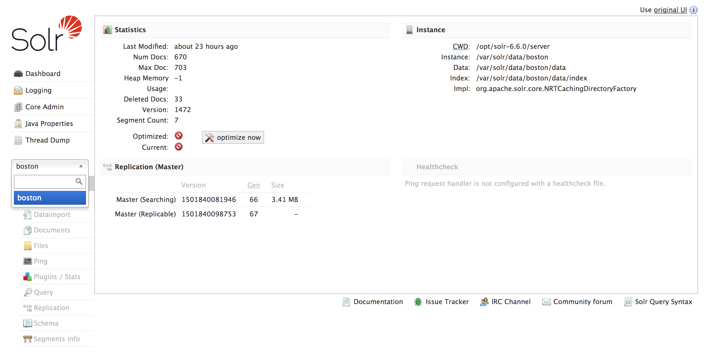

In case you need to restart from scratch, here is how to remove the core:

```sh
$ sudo su solr
$ cd /opt/solr-6.6.0/bin/
$ ./solr delete -c boston
```

## Create a schema

Solr stores details about the field types and fields it is expected to understand in a schema file. The name and location of this file may vary depending on how you initially configured Solr or if you modified it later.

managed-schema is the name for the schema file Solr uses by default to support making schema changes at runtime via the Schema API, or Schemaless Mode features.

You will create the schema for the *boston* core by sending POST JSON requests to the Solr API (http://localhost:8983/solr/boston/schema endpoint) with Python and the great [Requests Python library](http://docs.python-requests.org/en/master/)

Create a directory where you will add the Python script, a __init__.py file into it and then the Python script itself (named *solr_schema*):

```sh
$ mkdir /workshop/foss4g_scripts
$ touch /workshop/foss4g_scripts/__init__.py
$ touch /workshop/foss4g_scripts/solr_schema.py
```

The __init__.py files is required to make Python treat the directory as containing packages. This way you will be able to import the solr_schema package in the Django shell.

Add the following Python code to the *solr_schema.py* script:

```python
import requests


schema_url = "http://localhost:8983/solr/boston/schema"


def create_schema():
    """
    Create the schema in the solr core.
    """

    # create a special type to draw better heatmaps
    location_rpt_quad_5m_payload = {
        "add-field-type": {
            "name": "location_rpt_quad_5m",
            "class": "solr.SpatialRecursivePrefixTreeFieldType",
            "geo": False,
            "worldBounds": "ENVELOPE(-180, 180, 180, -180)",
            "prefixTree": "packedQuad",
            "distErrPct": "0.025",
            "maxDistErr": "0.001",
            "distanceUnits": "degrees"
        }
    }
    requests.post(schema_url, json=location_rpt_quad_5m_payload)

    # create the DateRangeField type
    date_range_field_type_payload = {
        "add-field-type": {
            "name": "rdates",
            "class": "solr.DateRangeField",
            "multiValued": True
        }
    }
    requests.post(schema_url, json=date_range_field_type_payload)

    # now the other fields. The types are common and they are added by default to the Solr schema
    fields = [
        {"name": "name", "type": "string"},
        {"name": "title", "type": "string"},
        {"name": "abstract", "type": "string"},
        {"name": "bbox", "type": "location_rpt_quad_5m"},
        {"name": "category", "type": "string"},
        {"name": "modified_date", "type": "rdates"},
        {"name": "username", "type": "string"},
        {"name": "keywords", "type": "string", "multiValued": True},
        {"name": "regions", "type": "string", "multiValued": True},
    ]

    headers = {
        "Content-type": "application/json"
    }

    for field in fields:
        data = {
            "add-field": field
        }
        requests.post(schema_url, json=data, headers=headers)

    print 'Schema generated.'
```

Now run the script using the Django shell. Before of that create a symbolic link to the foss4g_scripts directory:

```sh
$ cd /workshop/geonode/
ln -s ../foss4g_scripts .
$ python manage.py shell
>>> from foss4g_scripts import solr_schema
>>> solr_schema.create_schema()
```

Make sure the schema was generated by checking the schema endpoint at the Solr administrative site: http://localhost:8983/solr/#/boston/schema

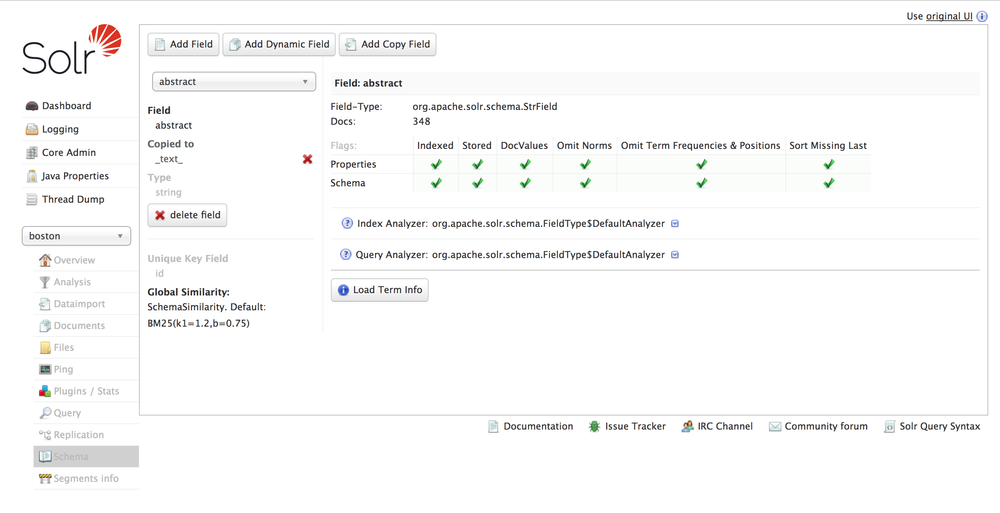

## Indexing data

The way you can pair Solr to GeoNode is by keeping in sync the GeoNode metadata for each layer, which are contained in a relational structure, to the Solr denormalized structure, based on documents. You will keep in sync the single metadata record for a given layer to the Solr document for that layer. In this tutorial you will keep in sync only some of the metadata, but once you master the concept the possibilities are limitless.

There is a number of way to load (index) data in Solr. Here you will use Python the [Requests Python library](http://docs.python-requests.org/en/master/) to send POST JSON request to the Solr endpoint in order to create and update documents.

Create the Python script:

```sh
$ touch touch /workshop/foss4g_scripts/geonode2solr.py
```

Now add this Python code in geonode2solr.py:

```python
import json
import requests
from geonode.layers.models import Layer


def layer2dict(layer):
    """
    Return a json representation for a GeoNode layer.
    """
    category = ''
    if layer.category:
        category = layer.category.gn_description
    wkt = "ENVELOPE({:f},{:f},{:f},{:f})".format(layer.bbox_x0, layer.bbox_x1, layer.bbox_y1, layer.bbox_y0)
    layer_dict = {
                    'id': str(layer.uuid),
                    'name': layer.name,
                    'title': layer.title,
                    'abstract': layer.abstract,
                    'bbox': wkt,
                    'category': category,
                    'modified_date': layer.date.isoformat()[0:22] + 'Z',
                    'username': layer.owner.username,
                    'keywords': [kw.name for kw in layer.keywords.all()],
                    'regions': [region.name for region in layer.regions.all()],
                }
    print layer_dict
    return layer_dict


def layer_to_solr(layer):
    """
    Sync a layer in Solr.
    """

    layer_dict = layer2dict(layer)

    layer_json = json.dumps(layer_dict)

    url_solr_update = 'http://localhost:8983/solr/boston/update/json/docs'
    headers = {"content-type": "application/json"}
    params = {"commitWithin": 1500}
    res = requests.post(url_solr_update, data=layer_json, params=params,  headers=headers)
    print res.json()


def sync():
    """
    Sync GeoNode layers with Solr.
    """
    for layer in Layer.objects.all():
        print 'Syncing layer %s to Solr' % layer.name
        layer_to_solr(layer)
```

Now run the script using the Django shell:

```sh
$ cd /workshop/geonode/
$ python manage.py shell
>>> from foss4g_scripts import geonode2solr
>>> geonode2solr.sync()
```

Check if data were added to Solr by checking this endpoint (more on this later): http://localhost:8983/solr/boston/select?indent=on&q=*:*&wt=json

## Indexing more data

A search engine is really useful when there are hundreds if not thousands of records to search. Your workshop GeoNode instance right now contains not even 10 layers (metadata records). Therefore for the aim of the tutorial you need a more extended instance with at least some hundreds of metadata.

For this purpose you will harvest metadata for a very large CSW catalogue using Python and OWSLib, and will index these metadata in Solr. The catalogue you are going to use for this purpose is [Harvard Hypermap](http://hh.worldmap.harvard.edu/), which right now contains almost 200,000 layers metadata records. In case you are interested in Harvard Hypermap code base, you can check it out the [CGA Harvard Hypermap github repository](https://github.com/cga-harvard/HHypermap)

You will harvest not all of the HHypermap layers, but just a part of them.

To make things more heterogeneous you will:

* add to each layer's metadata a random category (from the ones in GeoNode)
* use for each layer's metadata a random date (from 01-01-1970 to 12-01-2016)
* add to each layer's metadata up to 5 different regions (from the ones in GeoNode)
* add to each layer's metadata up to 5 different keywords (from an hard coded list)

Feel free to modify the script a you wish.

Create a Python script named *csw2solr.py*:

```sh
$ touch touch /workshop/foss4g_scripts/csw2solr.py
```

Add this Python code in the csw2solr script:

```python
import json
import requests
import datetime
from random import randint
from owslib.csw import CatalogueServiceWeb
from geonode.base.models import TopicCategory, Region


def get_random_date():
    """ Get a random date between 01-01-1970 and 12-01-2016 """
    return datetime.date(randint(1970,2016), randint(1,12),randint(1,28))


def get_random_category():
    """ Get a random category from GeoNode """
    random_index = randint(0, TopicCategory.objects.all().count() - 1)
    tc = TopicCategory.objects.all()[random_index]
    return tc


def add_random_regions():
    """ Get up to 5 random regions from GeoNode """
    regions = []
    for i in range(0, randint(0, 5)):
        random_index = randint(0, Region.objects.all().count() - 1)
        region = Region.objects.all()[random_index]
        regions.append(region)
    return regions


def add_random_keywords():
    """ Get up to 5 random keywords """
    keywords_list = [
        "geology", "transportation", "utility", "agricolture",
        "idrology", "society", "biology", "industry", "USA",
        "environment", "pollution", "university", "research"
    ]
    keywords = []
    for i in range(0, randint(0, 5)):
        random_index = randint(0, len(keywords_list) - 1)
        keyword = keywords_list[random_index]
        keywords.append(keyword)
    return keywords

def layer2dict(layer):
    """
    Return a json representation for a csw layer.
    """
    wkt = "ENVELOPE({:f},{:f},{:f},{:f})".format(layer.bbox_x0, layer.bbox_x1, layer.bbox_y1, layer.bbox_y0)
    layer_dict = {
                    'id': str(layer.uuid),
                    'name': layer.name,
                    'title': layer.title,
                    'abstract': layer.abstract,
                    'bbox': wkt,
                    'category': layer.category.gn_description,
                    'modified_date': layer.date.isoformat() + 'T00:00:00Z',
                    'keywords': [kw for kw in layer.keywords],
                    'regions': [region.name for region in layer.regions],
                }
    print layer_dict
    return layer_dict


def layer_to_solr(layer):
    """
    Sync a layer in Solr.
    """
    layer_dict = layer2dict(layer)
    layer_json = json.dumps(layer_dict)
    url_solr_update = 'http://localhost:8983/solr/boston/update/json/docs'
    headers = {"content-type": "application/json"}
    params = {"commitWithin": 1500}
    res = requests.post(url_solr_update, data=layer_json, params=params,  headers=headers)
    print res.json()


def sync():
    """
    Sync a bunch of csw layers with Solr.
    """

    class cswLayer(object):
        pass

    csw = CatalogueServiceWeb('http://hh.worldmap.harvard.edu/registry/hypermap/csw')
    count = 0
    for startposition in range(0, 2000, 10):
        csw.getrecords2(maxrecords=10, startposition=startposition)
        print csw.results
        for uuid in csw.records:
            record = csw.records[uuid]
            if record.bbox.crs.code == 4326:
                print record.bbox.minx, record.bbox.miny, record.bbox.maxx, record.bbox.maxy
                layer = cswLayer()
                layer.bbox_x0 = float(record.bbox.minx)
                layer.bbox_y0 = float(record.bbox.miny)
                layer.bbox_x1 = float(record.bbox.maxx)
                layer.bbox_y1 = float(record.bbox.maxy)
                if layer.bbox_x0 >= -180 and layer.bbox_x1 <= 180 and layer.bbox_y0 >= -90 and layer.bbox_y1 <= 90:
                    layer.uuid = uuid
                    layer.name = uuid
                    layer.title = record.title
                    layer.abstract = record.abstract
                    layer.url = record.source
                    layer.date = get_random_date()
                    layer.category = get_random_category()
                    layer.regions = add_random_regions()
                    layer.keywords = add_random_keywords()
                    layer_to_solr(layer)
                    print 'Imported record %s' % count
                    count += 1
    print 'Done.'

```

Now run the script using the Django shell:

```sh
$ cd /workshop/geonode/
$ python manage.py shell
>>> from foss4g_scripts import csw2solr
>>> csw2solr.sync()
```

The number of documents in the *boston* Solr core now should be much larger. You can check it at: http://localhost:8983/solr/boston/select?indent=on&q=*:*&wt=json

Note: you may notice that even if index content more than once by running more time the Python scripts, it does not duplicate the results found. This is because the Solr schema for the *boston* core specifies a "uniqueKey" field called "id". Whenever you POST commands to Solr to add a document with the same value for the uniqueKey as an existing document, it automatically replaces it for you.

## A quick tour of Solr administrative interface

> Solr features a Web interface that makes it easy for Solr administrators and programmers to view Solr configuration details, run queries and analyze document fields in order to fine-tune a Solr configuration and access online documentation and other help.

Accessing the URL http://hostname:8983/solr/ will show the main **dashboard**. The dashboard displays information related to the Solr, Lucene and Java versions being used, some Java settings and information about the system (such as the physical and the JVM memory)

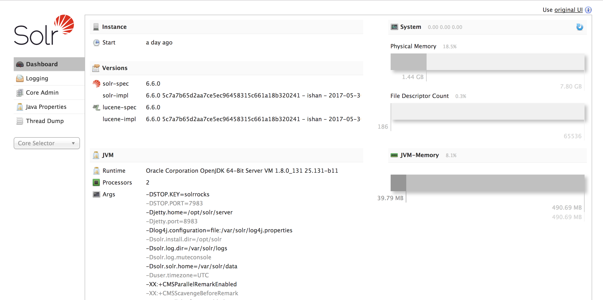

From the dashboard it is possible to navigate to other pages of the administrative interface. The **logging** page displays the latest log messages (which are accessible in more complete way using the tail or the less linux command in the shell)

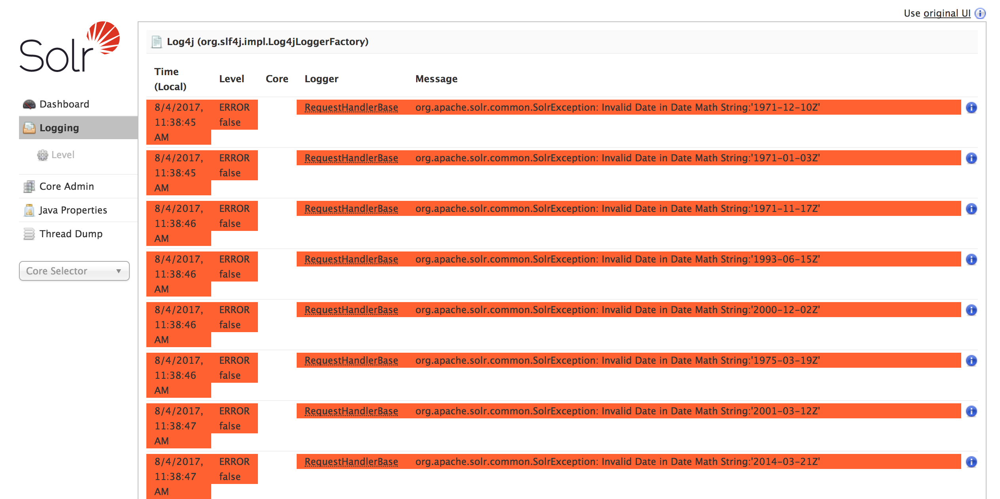

Clicking on the *level* menu it is possible to acces to the **Logging Level** page, from where it is possible to change the logging level

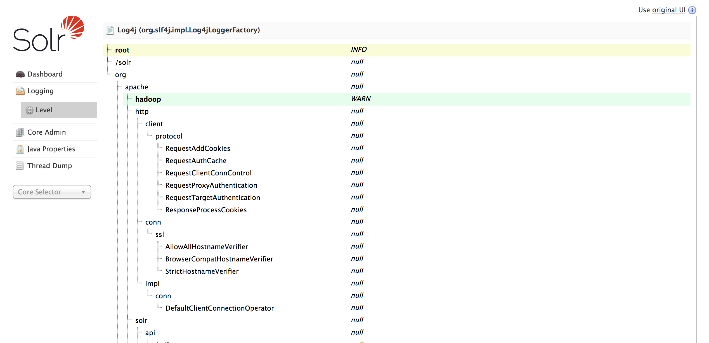

From the **Core Admin** pages it is possible to create new cores, or renaming and reloading existing ones. For each core it is possible to see the main related information, such as the data directory path, the number of indexed documents and the core start time

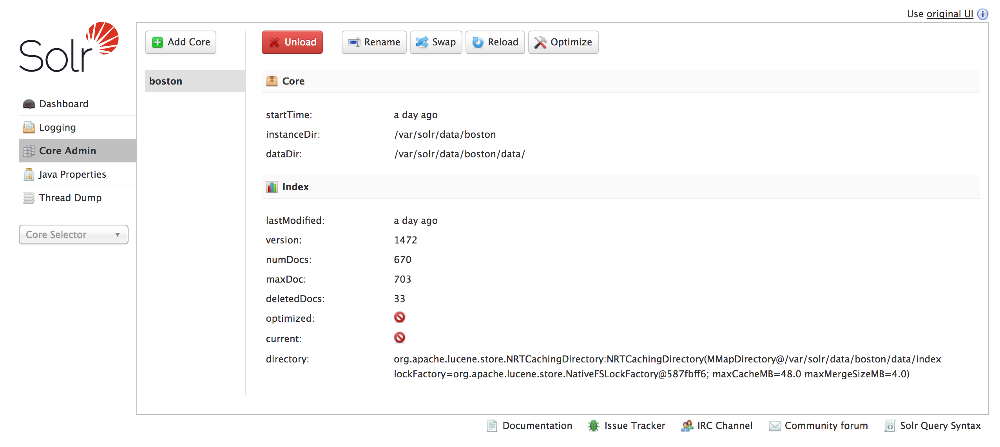

The **Java Properties** page displays the main information related to the Java environment: for example from here you can know which version of Java is being used, and which Java libraries are currently in the Java Path

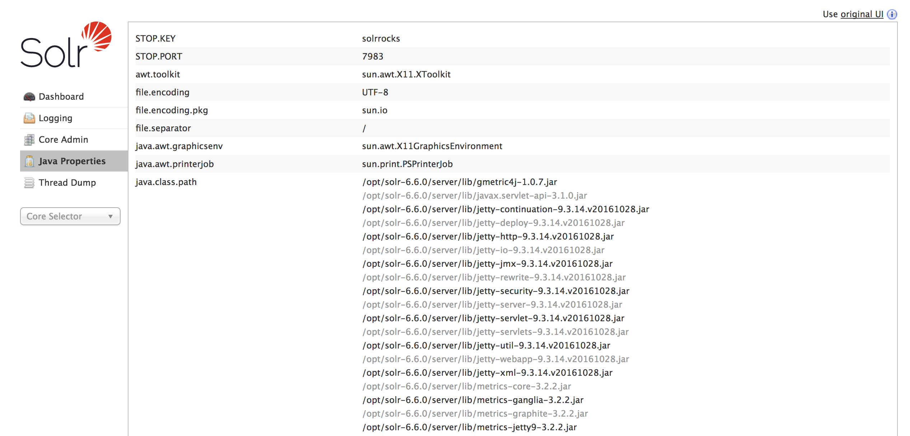

Using the **Core Overview** page, you can gain access to information related to a given core, for example the core data location and the number of indexed documents

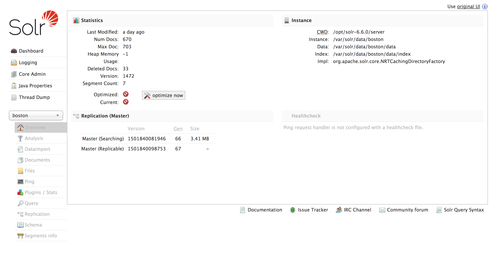

The **Core Documents** page provides a convenient form to index or update documents in Solr in different formats (JSON, XML, CSV...)

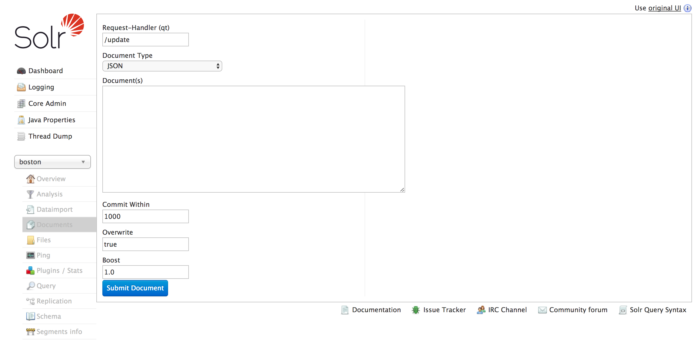

**Core Files** gives access to core configuration file (that can be anyway accessed from the shell in the server) such as the schema, the stopwords and the synonimus configuration files

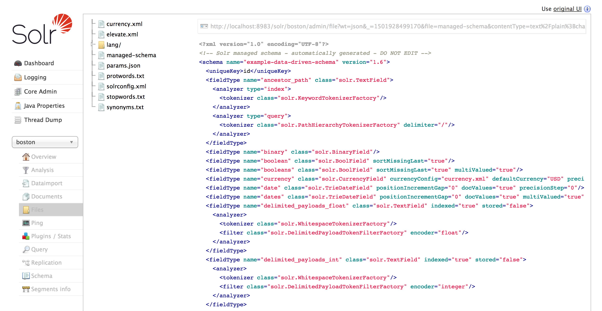

**Core Query** page provides a very useful form that let you build query to the Solr core. From the form it is possible to insert query parameters such as the request handler ('/SELECT' by default), *q* (query string), *fq* (filer query), *sort* (sort field, which may be *ASC* or *DESC*), *start* and *rows* (needed for pagination), *fl* (fields list), *wt* (response format, default being XML), and many other parameters. By Clicking the *Execute Query* button the response will be displayed together with the convenient URL generated by the query builder

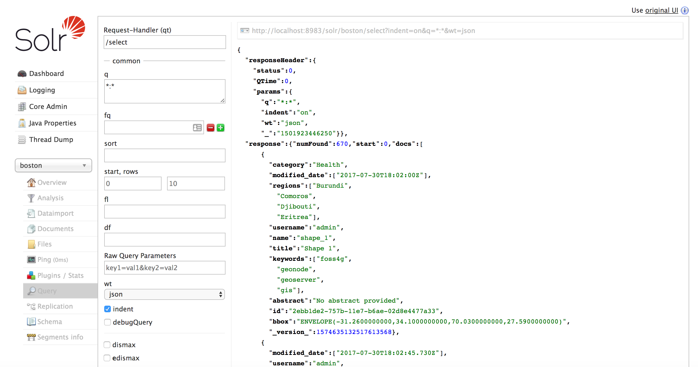

**Core Replication** page provides a page to configure Solr replication

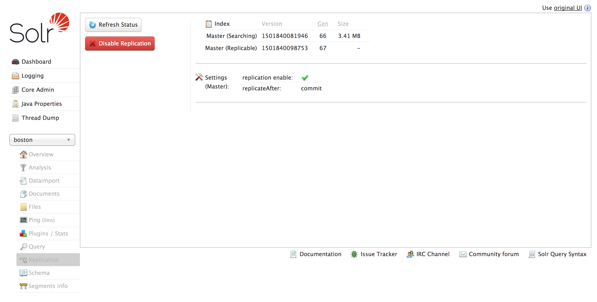

**Core Schema** provides a form to add, modify and remove fields from the schema. When adding fields, it is possible to specify if the field is a regular, dynamic or copy field.

> A dynamic field is just like a regular field except it has a name with a wildcard in it. When you are indexing documents, a field that does not match any explicitly defined fields can be matched with a dynamic field.

> You might want to interpret some document fields in more than one way. Solr has a mechanism for making copies of fields so that you can apply several distinct field types to a single piece of incoming information. A common usage for this functionality is to create a single "search" field that will serve as the default query field when users or clients do not specify a field to query.

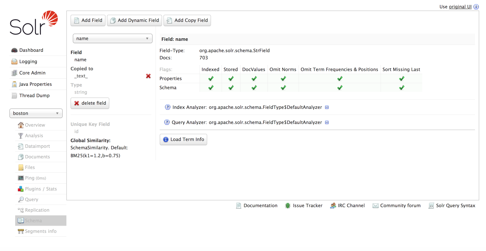

## Querying Solr

Now that you uploaded a bunch of data to Solr, you can start sending queries and figure out which way it can be very powerful to pair a search engine to your portal.

You can test all of the following queries by directly clicking on the url, or by composing the queries using the Solr admin query builder: http://localhost:8983/solr/#/boston/query

### Keyword matching

Get all of the field values of all of the records: q=*:*

http://localhost:8983/solr/boston/select?&q=*:*

This is what you will see:

```
{
  "responseHeader":{
    "status":0,
    "QTime":3,
    "params":{
      "q":"*:*",
      "indent":"on",
      "wt":"json",
      "_":"1501923446250"}},
  "response":{"numFound":670,"start":0,"docs":[
      {
        "category":"Health",
        "modified_date":["2017-07-30T18:02:00Z"],
        "regions":["Burundi",
          "Comoros",
          "Djibouti",
          "Eritrea"],
        "username":"admin",
        "name":"shape_1",
        "title":"Shape 1",
        "keywords":["foss4g",
          "geonode",
          "geoserver",
          "gis"],
        "abstract":"No abstract provided",
        "id":"2ebb1de2-757b-11e7-b6ae-02d8e4477a33",
        "bbox":"ENVELOPE(-31.2600000000,34.1000000000,70.0300000000,27.5900000000)",
        "_version_":1574635132517613568},
      {
        "modified_date":["2017-07-30T18:02:45.730Z"],
```

Have a look at this response: the response "responseHeader" section indicates the parameters used in the query and the response time used by Solr.

The "response" section indicates that there are 670 hits ("numFound":670), of which the first 10 were returned, since by default Solr uses start=0 and rows=10 as the pagination parameters. You can specify these params to page through results, where start is the (zero-based) position of the first result to return, and rows is the page size.

For example you can paginate records results starting from the 50th till the 70th using: rows=20&start=50 (rows is 10 by default)

http://localhost:8983/solr/boston/select?indent=on&q=*:*&rows=20&start=50

You can use the *wt* parameter to get all of the records in a given format, for example json (wt by default is xml):

http://localhost:8983/solr/boston/select?indent=on&q=*:*&wt=json

This is how you can query a field with an exact text string: q=title:"Landscape condition"

http://localhost:8983/solr/boston/select?indent=on&q=title:Landscape%20condition&wt=json

To query a field with a wildcard: q=abstract:Natura*

http://localhost:8983/solr/boston/select?indent=on&q=abstract:Natura*&wt=json

Full text query with more parameters: q=_text_:soil% AND _text_:database

http://localhost:8983/solr/boston/select?indent=on&q=_text_:soil%20and%20_text_:database&rows=10&start=0&wt=json

Note: by default Solr creates a *_text_* copy field where a copy of all of the other fields is appended. This makes it as a convenient field to use for string searching

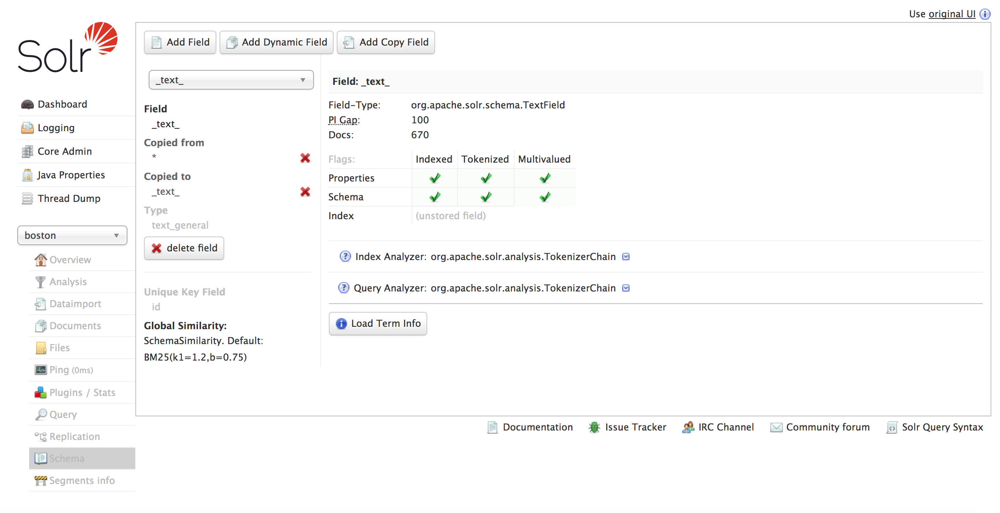

You can use the *fl* parameter (fields list) to return only some of the fields, for example: fl=title, abstract

http://localhost:8983/solr/boston/select?fl=title,%20abstract&indent=on&q=*:*&rows=10&start=0&wt=json

Query a multiValued field (fields which can store arrays of values): regions:Antarctica OR regions:Asia

http://localhost:8983/solr/boston/select?indent=on&q=regions:Antarctica%20or%20regions:Asia&rows=10&start=0&wt=json

Use the *sort* parameter to sort by a field (you need to specify *asc* or *desc* to specify sort order): q=*:*&sort=title asc

http://localhost:8983/solr/boston/select?indent=on&q=*:*&sort=title%20asc&wt=json

### Scored results

Solr can return results with a score, calculated by Lucene. Score indicates how much a given document is relevant for a user. For getting this you need to specify *score* in the *fl* parameter:

http://localhost:8983/solr/boston/select?fl=*,score&indent=on&q=_text_:geographic&rows=10&start=0&wt=json

### Proximity matching

Lucene supports finding words that are within a specific distance away. For exmaple, to search for "service information" within 4 words from each other you can do like this: _text_:"service,information"~4

http://localhost:8983/solr/boston/select?indent=on&q=_text_:%22service%20information%22~4&rows=10&start=0&wt=json

### Boosts

Query-time boosts allow one to specify which terms/clauses are "more important". The higher the boost factor, the more relevant the term will be, and therefore the higher the corresponding document scores.

A typical boosting technique is assigning higher boosts to title matches than to body content matches:

(title:service OR title:information)^1.5 (abstract:service OR abstract:information)

http://localhost:8983/solr/boston/select?indent=on&q=(title:*service*%20OR%20title:*information*)^1.5%20(abstract:*service*%20OR%20abstract:*information*)&rows=10&start=0&wt=json

### Date ranges

Solr provides a very powerful and convenient syntax to query dates and date ranges. If you want to get documents having a date field in a given date range here is how you can do it: q=modified_date:[1970-01 TO 1990-12]

http://localhost:8983/solr/boston/select?indent=on&q=modified_date:[2016-11%20TO%202016-12]&wt=json

Date range syntax can be more complex:

http://localhost:8983/solr/boston/select?indent=on&q=modified_date:[*%20TO%202016-11]&wt=json

http://localhost:8983/solr/boston/select?indent=on&q=modified_date:[2016-11%20TO%20NOW]&wt=json

http://localhost:8983/solr/boston/select?indent=on&q=modified_date:[2016-11%20TO%20NOW-10DAY]&wt=json

### Spatial Search

Solr provides native spatial query syntax, thanks to its underlying engine based on [JTS Topology Suite](https://sourceforge.net/projects/jts-topo-suite/).

There are different spatial field types in Solr, and all of them let to search documents given a spatial extent. Some of the spatial fields can even be used to provide a spatial representation: for example GeoServer with the [Solr plugin](http://docs.geoserver.org/stable/en/user/community/solr/index.html) makes possible to publish documents directly from Solr.

There are two different filters to search documents by extent. You will use both of them to search the *boston* Solr core using the *bbox* spatial field.

#### geofilt spatial filter

The *geofilt* filter allows you to retrieve results based on the geospatial distance from a given point (a buffer around a point). For example, to find all documents within five kilometers of a given lat/lon point, you could enter &q=*:*&fq={!geofilt sfield=bbox}&pt=45.15,-93.85&d=5

http://localhost:8983/solr/boston/select?d=1&indent=on&wt=json&q=*:*&fq={!geofilt%20sfield=bbox}&pt=-71.10,42.37&d=5

#### bbox spatial filter

The *bbox* filter is very similar to *geofilt* except it uses the bounding box of the calculated circle

http://localhost:8983/solr/boston/select?d=1&indent=on&wt=json&q=*:*&fq={!bbox%20sfield=bbox}&pt=-71.10,42.37&d=5

#### filtering by arbitrary extent

It is easy to filter Solr documents by an arbitrary extent: &q=*:*&fq=store:[45,-94%20TO%2046,-93]

http://localhost:8983/solr/boston/select?d=1&indent=on&wt=json&q=*:*&fq=bbox:[-71,42%20TO%20-70,43]

### Faceting

> *Faceting* is the arrangement of search results into categories based on indexed terms. Searchers are presented with the indexed terms, along with numerical counts of how many matching documents were found were each term. Faceting makes it easy for users to explore search results, narrowing in on exactly the results they are looking for.

Faceting can be based on keywords, but also on dates and spatial extents.

#### Keyword facets

In the context of an SDI portal such as with GeoNode, *keyword facets* can be useful to provide an immediate indication of the number of matching layers and maps for each given tag, category or region.

Number of layers for each given keyword:

http://localhost:8983/solr/boston/select?facet.field=keywords&facet=on&indent=on&q=*:*&rows=10&wt=json

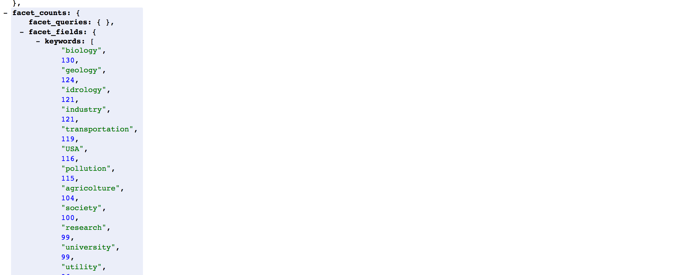

Number of layers for each given region:

http://localhost:8983/solr/boston/select?facet.field=regions&facet=on&indent=on&q=*:*&rows=10&wt=json

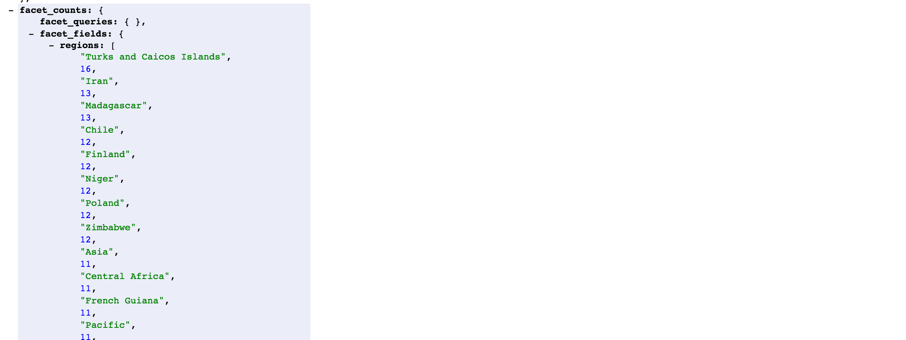

Number of layers for each given category:

http://localhost:8983/solr/boston/select?facet.field=category&facet=on&indent=on&q=*:*&rows=10&wt=json

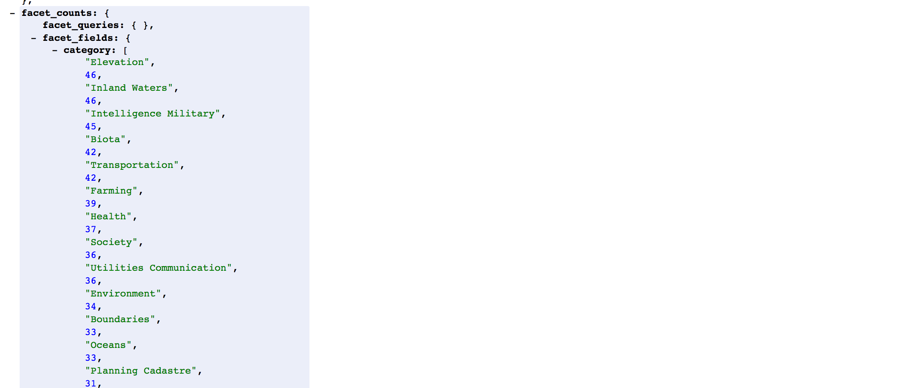

#### Temporal facets

*temporal facets* can be useful to provide users an indication of the number of layers and maps with metadata within given temporal ranges. For example to provide a geo portal with an histogram which tracks how many layers are available in the portal with a representational date falling within each month, year or century.

Number of layers per year in the last 50 years:

http://localhost:8983/solr/boston/select?q=*:*&facet.range=modified_date&facet=true&facet.range.start=NOW-50YEAR&facet.range.end=NOW&facet.range.gap=%2B1YEAR&wt=json

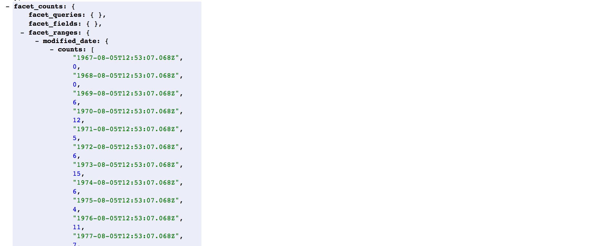

Number of layers per month in the last 50 years:

http://localhost:8983/solr/boston/select?q=*:*&facet.range=modified_date&facet=true&facet.range.start=NOW-50YEAR&facet.range.end=NOW&facet.range.gap=%2B1MONTH&wt=json

#### Spatial facets

Solr spatial field supports generating a 2D grid of facet counts for documents having spatial data in each grid cell.  For high-detail grids, this can be used to plot points, and for lesser detail it can be used for heatmap generation.

http://localhost:8983/solr/boston/select?q=*:*&facet=true&facet.heatmap=bbox&facet.heatmap.geom["-180%20-90"%20TO%20"180%2090"]&wt=json

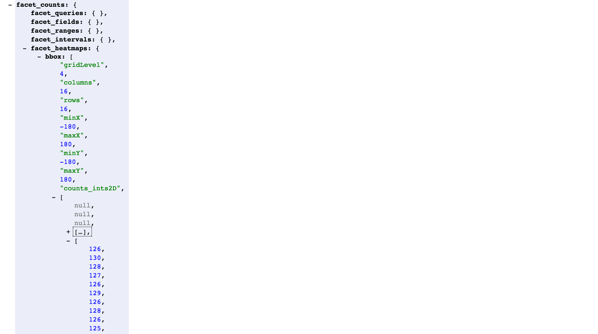

> The minX, maxX, minY, maxY reports the region where the counts are.  This is the minimally enclosing bounding rectangle of the input geom at the target grid level.
> The columns and rows values are how many columns and rows that the output rectangle is to be divided by evenly.
> The counts_ints2D key has a 2D array of integers.  The initial outer level is in row order (top-down), then the inner arrays are the columns (left-right).  If any array would be all zeros, a null is returned instead for efficiency reasons.  The entire value is null if there is no matching spatial data.
