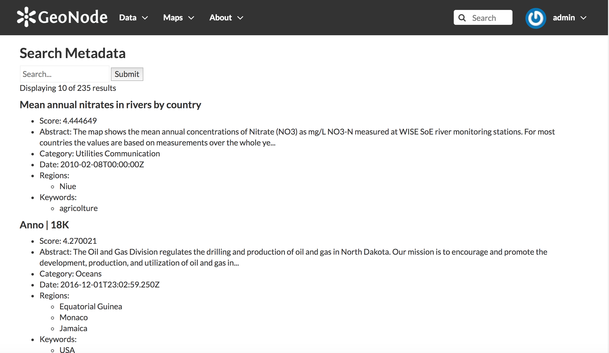

# Developing a custom application for GeoNode

In this tutorial you will learn how to create a custom Django application and use it in GeoNode.

The application you will create is intended to query Solr to provide the end users with a metadata full text search tool. The application will have a web page with a form, from where in a text box the user will be able to enter a search string. When submitting the form a query will be sent to Solr and the first 10 results will be displayed in the page.

Each result will contain the main metadata record information (title, abstract, category...) and its score.

## Create the Django application

As a first thing you need to create the Django application, which you will name *solr*. For this purpose open a shell window, activate the virtual environment and create the application using the *startapp* option of the Django *manage.py* command:

```sh
$ . /workshop/env/bin/activate
$ cd /workshop/geonode
$ mkdir geonode/solr
$ python manage.py startapp solr geonode/solr
```

## Create a template

You will create a Django template containing the user interface of the application. The user interface will have a form to enter the search string and a list of results.

> Being a web framework, Django needs a convenient way to generate HTML dynamically. The most common approach relies on templates. A template contains the static parts of the desired HTML output as well as some special syntax describing how dynamic content will be inserted.

> A Django project can be configured with one or several template engines (or even zero if you don’t use templates). Django ships built-in backends for its own template system, creatively called the Django template language (DTL), and for the popular alternative Jinja2. Backends for other template languages may be available from third-parties.

Create the template:

```sh
$ mkdir -p geonode/sol/templates/solr
$ touch geonode/solr/templates/solr/index.html
```

Add [this html code](https://gist.github.com/capooti/77fb92ebaa505760488fbb524e917923) in the *geonode/solr/index.html* template.

## Create the url dispatcher

To design URLs for an application in Django, you create a Python module informally called a URL configuration, which is named *urls.py*

GeoNode has a main *urls.py* URL configuration at geonode/urls.py The recommended approach for a Django application is to have its own URL configuration, and import it from the main URL configuration.

Therefore you are going to import the Solr application URL configuration (which will be in a file *geonode/solr/urls.py*) from the GeoNode main URL configuration.

For this purpose, add this code at the end of *geonode/urls.py*

```python
# solr application urls
urlpatterns += patterns('',
    url(r'^solr/', include('geonode.solr.urls')),
)
```

Now create the Solr application URL configuration file:

```sh
$ touch geonode/solr/urls.py
```

Add this code in *geonode/solr/urls.py*:

```python
from django.conf.urls import patterns, url

urlpatterns = patterns('geonode.solr.views',
                       url(r'^$', 'index', name='index'),
                       )
```

There is only one URL that the user can use in the solr application: its path will be http://localhost:8000/solr/

## Add the application in INSTALLED_APPS

Each Django application that is intended to use in a project must be added in the INSTALLED_APPS Django setting.

The main GeoNode *settings.py* file is at *geonode/settings.py* and contains the following applications in the INSTALLED_APPS setting:

```python
GEONODE_APPS = (
    # GeoNode internal apps
    'geonode.people',
    'geonode.base',
    'geonode.layers',
    'geonode.maps',
    'geonode.proxy',
    'geonode.security',
    'geonode.social',
    'geonode.catalogue',
    'geonode.documents',
    'geonode.api',
    'geonode.groups',
    'geonode.services',

    # QGIS Server Apps
    # 'geonode_qgis_server',

    # GeoServer Apps
    # Geoserver needs to come last because
    # it's signals may rely on other apps' signals.
    'geonode.geoserver',
    'geonode.upload',
    'geonode.tasks',

)

GEONODE_CONTRIB_APPS = (
    # GeoNode Contrib Apps
    'geonode.contrib.dynamic',
    'geonode.contrib.exif',
    'geonode.contrib.favorite',
    'geonode.contrib.geogig',
    'geonode.contrib.geosites',
    'geonode.contrib.nlp',
    'geonode.contrib.slack',
    'geonode.contrib.metadataxsl'
)

# Uncomment the following line to enable contrib apps
# GEONODE_APPS = GEONODE_APPS + GEONODE_CONTRIB_APPS

INSTALLED_APPS = (

    'modeltranslation',

    # Boostrap admin theme
    # 'django_admin_bootstrapped.bootstrap3',
    # 'django_admin_bootstrapped',

    # Apps bundled with Django
    'django.contrib.auth',
    'django.contrib.contenttypes',
    'django.contrib.sessions',
    'django.contrib.sites',
    'django.contrib.admin',
    'django.contrib.sitemaps',
    'django.contrib.staticfiles',
    'django.contrib.messages',
    'django.contrib.humanize',
    'django.contrib.gis',

    # Third party apps

    # Utility
    'pagination',
    'taggit',
    'treebeard',
    'friendlytagloader',
    'geoexplorer',
    'leaflet',
    'django_extensions',
    #'geonode-client',
    # 'haystack',
    'autocomplete_light',
    'mptt',
    # 'modeltranslation',
    # 'djkombu',
    'djcelery',
    # 'kombu.transport.django',
    'storages',

    # Theme
    "pinax_theme_bootstrap_account",
    "pinax_theme_bootstrap",
    'django_forms_bootstrap',

    # Social
    'account',
    'avatar',
    'dialogos',
    'agon_ratings',
    # 'notification',
    'announcements',
    'actstream',
    'user_messages',
    'tastypie',
    'polymorphic',
    'guardian',
    'oauth2_provider',

) + GEONODE_APPS

```

You will customize the INSTALLED_APPS setting by changing its value in *geonode/local_settings.py*. At the end of that file add the following lines:

```python
from django.conf import settings
settings.INSTALLED_APPS = settings.INSTALLED_APPS + ('geonode.solr',)
LOCAL_ROOT = os.path.abspath(os.path.dirname(__file__))
settings.TEMPLATES[0]['DIRS'].insert(0, os.path.join(LOCAL_ROOT, "solr/templates"))
```

## Create the view

> A Django view function, or view for short, is simply a Python function that takes a Web request and returns a Web response. This response can be the HTML contents of a Web page, or a redirect, or a 404 error, or an XML document, or an image . . . or anything, really. The view itself contains whatever arbitrary logic is necessary to return that response. This code can live anywhere you want, as long as it’s on your Python path.

Here you will create the view which will process the user request. The view will get the query string from the web request, and then will send a query to Solr using the Requests Python library.

Then the view will process the JSON response from Solr, and send the results (docs) dictionary and the count of the results to the template.

Add this code to create the view in *geonode/solr/views.py*:

```python
import json, requests
from django.shortcuts import render_to_response
from django.template import RequestContext


def index(request):
    '''
    A view to search metadata in Solr.
    '''

    search_text = '*'
    if request.method == 'GET':
            if 'search_text' in request.GET:
                search_text = request.GET.get('search_text', None)
    if not search_text:
        search_text = '*'

    url = 'http://localhost:8983/solr/boston/select'
    params = dict(
        q='_text_:%s' % search_text,
        fl='*,score',
        wt='json'
    )
    resp = requests.get(url=url, params=params)
    data = json.loads(resp.text)

    count = data['response']['numFound']
    docs = data['response']['docs']
    return render_to_response('solr/index.html',
                                RequestContext(request,
                                    {
                                        'docs': docs,
                                        'count': count,
                                    },
                                )
                            )
```

## Run the application

Now you should be ready to run the application. Make sure that GeoNode is correctly running, and then check if the application endpoint is operational: http://localhost:8000/solr/

If everything works, you should see the Solr's Django application rendered. Try to search metadata with any text string you like



## Bonus steps

### Solr pagination

As a bonus step, if you are feeling adventurous, try to implement Solr pagination.

Hint: you will need to read the *start* value in *views.py* from *data['response']* and pass it in the *RequestContext* dictionary, together with *docs* and *count*.

### GeoNode Project

In this workshop you are customizing GeoNode by adding code files directly in the GeoNode directory cloned from GitHub. While this can be the fastest approach, it has a big limitation: at some point you will edit files from the GeoNode code base (for example you have edited *geonode/ulrs.py*) which will introduce a lot of problems when updating to a new version of GeoNode.

To avoid this problems, the recommended approach is to use a geonode-project: https://github.com/GeoNode/geonode-project

After forking your geonode-project, you will be able to customize GeoNode without touching any of the GeoNode core files. Therefore the GeoNode update procedure will be much easier.
